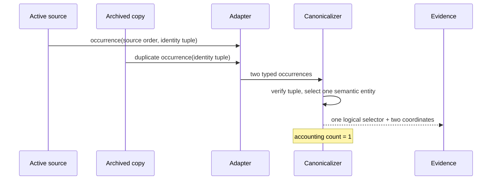

# Adapter and Normalization Contract

**Status:** Codex-first MVP authority
**Initial adapter:** `codex-jsonl`
**Contract:** `codex-usage-tracker.adapter.v1`

The adapter translates one upstream representation into canonical observations.
It does not own storage, publication, query plans, recommendations, or UI.

## Boundary

The Codex adapter owns:

- source discovery and technical inventory;
- JSONL framing and structural validation;
- source identity, manifestation revisions, and complete-record cursors;
- timestamp, enum, and integer normalization;
- adapter-native identities and canonical identity inputs;
- capability and measurement masks;
- model-call usage observations;
- session, parent/subagent, turn, tool, activity, compaction, resource,
  state-change, and allowance observations when structurally available;
- parse diagnostics and malformed-source isolation.

It does not own:

- canonical entity selection across occurrences;
- dirty-key projection maintenance;
- query or evidence presentation;
- rate-card interpretation beyond emitting observed model fields;
- causal attribution;
- natural-language classification;
- secret detection, redaction, or sanitization;
- raw-body persistence.

## Source discovery

The adapter returns a bounded inventory record before parsing:

```text
source_key
manifestation_key
source_kind
technical_path_key
display_label
filesystem_identity?
size_bytes
modified_at_us
prefix_fingerprint?
suffix_fingerprint?
time_range_hint?
time_range_confidence
state
```

`time_range_hint`, when present, is
`{start_us, end_us}` in integer UTC microseconds and describes the half-open
interval `[start_us, end_us)`. `time_range_confidence` is exactly one of:

- `trusted`: the conservative interval contains every structural event
  timestamp in the source and may prove that a whole source cannot overlap the
  selected history window;
- `uncertain`: the hint may guide ordering or hydration but cannot by itself
  make the source safely skippable, including sources that contain
  window-independent selector, oracle, lifecycle, or compatibility records;
- `unavailable`: no timestamp bound is established and the hint is `NULL`.

Malformed, deferred, empty, and no-timestamp sources never receive fabricated
bounds. Discovery may skip a source without hydration only when a `trusted`
half-open interval proves non-overlap. All `uncertain` or `unavailable` sources
remain selected or deferred with explicit coverage.

Named synthetic history windows retain their closed `[start_us, end_us]`
semantics. Therefore a half-open source hint overlaps such a window exactly
when `hint.end_us > window.start_us` and
`hint.start_us <= window.end_us`.

Discovery supports a byte and file budget. For first use, the planner selects
whole sources using trustworthy time-range hints and hydrates only uncertain
sources needed to prove the selected cutoff. Deferred sources remain in
coverage metadata.

Paths are normalized for stable local identity, not sanitized. Public MCP
results normally use logical resource labels and selectors rather than
technical source paths.

The frozen CK-03 synthetic manifest keeps
`codex-usage-tracker.synthetic-fixture-manifest.v1` and
`agent-kernel-structural-v1`: this is an additive correction of inventory
metadata already optional in adapter v1, not a source-event or oracle semantic
revision. Every synthetic source entry now requires both time-range fields, the
manifest digest identifies the corrected artifact, and the bake-off fixture
loader rejects pre-correction manifests.

## Cursor contract

A committed cursor contains:

- source manifestation ID and revision;
- byte offset immediately after the last complete JSONL record;
- stable record ordinal;
- source size and suffix fingerprint at commit;
- latest observed source order;
- parser/adapter version.

Resume is valid only when the same manifestation revision still has a matching
prefix through the cursor and the byte offset remains a complete-record
boundary. A partial final line is not consumed until complete.

Cursor outcomes:

| Observation | Classification | Required action |
| --- | --- | --- |
| Same revision, larger size, matching prefix | `append_safe` | Parse complete records after cursor. |
| Same bytes and metadata | `no_change` | No parse or fact write. |
| Size smaller than cursor | `truncated` | Mark old manifestation ended; parse replacement manifestation. |
| Prefix differs | `replaced` | Create new manifestation and recanonicalize affected identities. |
| Parser/identity version changed | `recanonicalize` | Use isolated artifact path; never ordinary tail. |
| Source missing | `missing` | Preserve prior evidence and update source state. |
| Malformed record | `malformed_range` | Isolate range, continue valid complete records, disclose coverage. |
| Timestamp older than current publication | `late_event` | Emit normal observation with its original total-order key. |

## Canonical output types

The adapter emits a stream of typed records:

```text
SourceManifestationObserved
ProjectObserved
SessionObserved
SessionRelationshipObserved
TurnBoundaryObserved
ModelCallObserved
ModelUsageObserved
ToolLifecycleObserved
ActivityLifecycleObserved
CompactionObserved
ResourceObserved
ToolResourceLinkObserved
StateChangeObserved
AllowanceLimitObserved
AllowanceObservationObserved
AdapterDiagnosticObserved
```

Every record contains:

- adapter and schema version;
- source manifestation/revision and occurrence coordinates;
- stable source order;
- event time in integer UTC microseconds or `NULL`;
- identity tuple and identity version;
- typed fields;
- capability and measurement mask;
- basis and confidence enums;
- optional diagnostic codes.

Unknown future fields are ignored only when the enclosing record version
permits additive fields. Unknown record kinds fail the affected range closed
and produce a diagnostic rather than being reclassified as a familiar fact.

## Timestamp normalization

1. Parse only documented upstream timestamp representations.
2. Convert exact instants to signed integer UTC microseconds.
3. Preserve the upstream precision basis.
4. Reject overflow, invalid timezone offsets, impossible calendar values, and
   lossy floating-point conversion.
5. Use source order to break equal timestamps.
6. Leave time `NULL` when the source does not establish it.

File modification time may guide source selection but never replaces an event
timestamp.

## Session and turn normalization

- Prefer an upstream stable session ID.
- Parent, root, and subagent relations include the exact upstream basis.
- A missing parent remains unresolved rather than inventing a root.
- Late parent discovery emits a relationship observation.
- Turns require a documented user-intent boundary or adapter lifecycle rule.
- Turn ordinals are deterministic within the canonical session order.
- An open tail remains open; end of file is not successful completion.
- Human labels are presentation observations with provenance, not identity
  inputs.

## Model calls and token usage

The adapter emits the four token classes independently. If upstream fields use
an inclusive input count, normalization derives uncached input only when:

```text
uncached_input = input_total - cached_input
```

and both values are observed, nonnegative, and compatible. The derivation basis
is recorded. Invalid or absent inputs yield `NULL`, not zero.

Model, reasoning effort, service tier, context window, completion status, and
error category remain separate optional fields. A model call may have multiple
observations that fold into one lifecycle entity.

## Tool classification

Tool classification has two independent levels:

1. `transport_name`: exact observed callable or host transport.
2. `semantic_operation`: deterministic metadata-only classification.

The initial semantic operations are:

```text
read
search
list
execute
write
patch
test
navigate
delegate
wait
unknown
```

Classification may inspect structured tool name and bounded structured
argument keys/values required to identify operation and resource. It does not
persist free-form command, patch, prompt, or tool-output bodies. An
unrecognized operation remains `unknown` with its transport name intact.

Tool start, progress, success, failure, cancellation, and rollback are separate
lifecycle transitions. Output bytes are recorded when the host exposes a
bounded structural size; the output itself is not stored.

## Resource extraction

The adapter may emit:

- resource kind;
- normalized project-relative or technical identity key;
- concise local display label;
- relationship role: read, searched, listed, executed, written, patched,
  tested, navigated, or delegated;
- extraction basis and confidence.

Resource normalization is versioned. Relative and absolute observations that
provably resolve to the same local resource may share identity. Ambiguous paths
remain separate rather than being guessed together.

## State-change evidence

A state change is emitted only from a structured upstream observation that
establishes a mutation, such as a documented applied-patch result or an
observed resource revision transition. A write-like tool call alone emits
write intent. A successful completion alone emits lifecycle success.

The adapter links a state change to its session and containing turn or phase.
It does not assign the mutation to only the immediately preceding call: the
observable outcome may result from the cumulative preceding calls and tools.
Ordered evidence lets the model inspect that sequence with
`causal_attribution = false`.

## Allowance extraction

The adapter retains every exact observation. It emits provider/limit/plan/window
identity, observation time, used/remaining fields, reset time, and measurement
mask. Identical consecutive percentages are not coalesced. Compatibility
intervals are built downstream from canonical adjacent observations.

## Duplicate observations

Adapter output may contain repeated occurrences from copied, archived, or
replaced files. The adapter never drops an occurrence solely because a
semantic identity was seen elsewhere. It emits occurrence provenance; the
canonicalization layer chooses one semantic entity and preserves all valid
evidence coordinates.




## Malformed-source isolation

- JSON parse, UTF-8, type, size, timestamp, and enum failures are attached to a
  bounded source range.
- Valid complete records before and after an isolatable bad line remain
  ingestible.
- A framing failure that prevents locating the next complete record stops only
  that source at the last valid cursor.
- Publication coverage discloses malformed source/range counts and bytes.
- A malformed source cannot invalidate the prior committed publication.

## Future-agent seam

A future adapter must implement the same inventory, cursor, typed observation,
capability, measurement, identity-input, diagnostic, and fixture contracts. It
may add adapter-specific record kinds only by mapping them to approved logical
primitives or by first amending the logical contract.

The core cannot import Codex parser types. Adapter registration is explicit at
the application boundary. No dynamic third-party plugin system, second adapter,
or cross-agent comparison is built for MVP.

## Required fixtures

The Codex adapter qualification suite includes synthetic cases for:

- complete, partial-final-line, malformed, truncated, replaced, archived, and
  copied sources;
- uncertain and late timestamps, equal timestamp ties, and precision edges;
- missing and late-discovered parents;
- open and completed turns;
- four token classes with missing and invalid combinations;
- tool start/complete/fail/cancel across publications;
- recognized and unknown semantic operations;
- ambiguous and equivalent resources;
- write intent without mutation, completion without mutation, and an observed
  mutation after multiple preceding activities;
- repeated allowance observations and reset changes;
- no raw bodies in adapter output or database-bound records.
