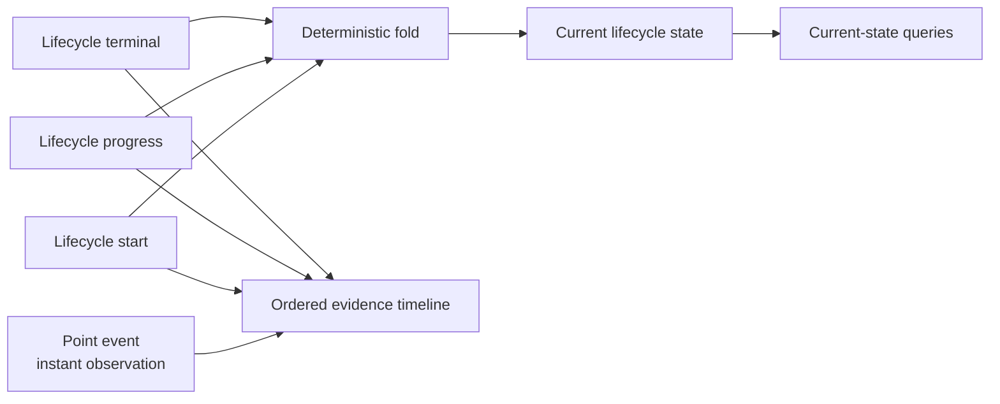
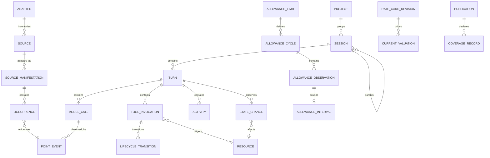
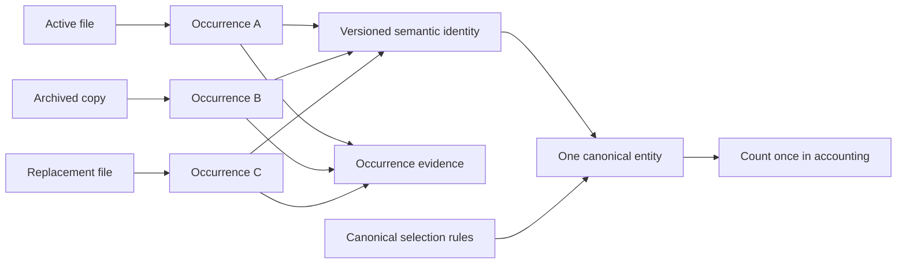

# Logical Kernel Contract

**Status:** Physical-design-independent implementation authority
**Schema family:** `codex-usage-tracker.agent-kernel.logical.v1`

This contract defines what the replacement means. Candidates A, C, and D may
store it differently, but they must expose identical identities, accounting,
ordering, coverage, evidence, and missingness.

## Global conventions

### Identifiers

- Every semantic entity has a stable logical ID produced by a versioned
  identity algorithm.
- IDs are opaque ASCII strings with an entity-kind prefix and versioned digest.
- SQLite row IDs and physical table keys are never public selectors.
- Identity inputs contain only canonical structural fields. Mutable labels,
  source path spellings, publication IDs, rate cards, and derived values are
  excluded.
- Hash collisions are detected by storing and comparing the normalized identity
  tuple. A collision fails publication; it never merges entities.
- Aliases map a retired selector to the same logical entity after a supported
  identity correction. Aliases cannot join distinct semantic entities.

Initial identity algorithm:

```text
id = kind + ":v1:" + base32(sha256(canonical_cbor(identity_tuple)))
```

Canonical CBOR is used only as a deterministic identity encoding. The selected
physical candidate may store a compact surrogate beside the logical ID.

### Time

- Stored timestamps are signed 64-bit integer UTC microseconds from the Unix
  epoch.
- A missing upstream timestamp is `NULL`; ingestion time does not replace it.
- Calendar queries require an IANA timezone and use half-open `[start, end)`
  boundaries converted once to integer UTC.
- Durations are integer microseconds. Negative observed durations are invalid
  measurements and remain unavailable with a diagnostic.
- Event total order is `(event_at_us, source_order, event_kind_order,
  logical_id)`. `source_order` is a stable adapter-provided tuple, not arrival
  order.
- Late events enter their correct total-order position without changing IDs.

### Missingness and grades

`NULL` means unobserved, unavailable, inapplicable, or invalid. It never means
zero. Every optional measurement has:

- an availability bit in a versioned measurement mask;
- a basis enum;
- optional capability requirement;
- optional diagnostic code.

Every returned value is graded `exact`, `deterministic`,
`configured_estimate`, `model_inference`, or `unsupported`. The database stores
only the first three. Inference and unsupported annotations belong to result
assembly or the consuming model, never canonical facts.

### Four token classes

Canonical usage stores:

- `uncached_input_tokens`
- `cached_input_tokens`
- `reasoning_tokens`
- `output_tokens`

The default billed-input interpretation is:

```text
input_tokens = uncached_input_tokens + cached_input_tokens
total_tokens = input_tokens + output_tokens
```

Reasoning tokens stay separate because providers may include them in output
accounting. A result that offers another total must name its formula and basis.
No aggregate may double-count cached or reasoning tokens.

## Entity ownership

The package paths describe the intended logical owners under
`src/codex_usage_tracker/agent_kernel/`; exact files may be adjusted by the
architecture decision without changing ownership.

| Entity or value object | Logical owner | Purpose |
| --- | --- | --- |
| Adapter identity and capability | `adapters/contracts` | Source kind, adapter version, and observable fields. |
| Source and manifestation | `sources` | Physical files, revisions, cursors, and occurrence provenance. |
| Project | `identity/projects` | Stable normalized workspace identity and human label candidates. |
| Session hierarchy | `identity/sessions` | Canonical session, root, parent, and descendant relationships. |
| Turn | `identity/turns` | Deterministic user-intent-to-terminal-boundary unit. |
| Point event | `facts/events` | Instantaneous observed event in total order. |
| Lifecycle entity and transition | `facts/lifecycle` | Start/complete/fail/cancel/open state across publications. |
| Model call and usage | `facts/model_calls` | Model profile and four token measurements. |
| Tool invocation | `facts/tools` | Transport, semantic operation, target/resource, status, output size, and duration. |
| Activity and compaction | `facts/activities` | Structured phase and context-boundary observations. |
| Resource | `facts/resources` | Normalized local target identity without raw body. |
| Observed state change | `facts/state_changes` | Mutation evidence distinct from tool intent or completion. |
| Context component | `capabilities/context` | Optional structural category counts and inclusion basis. |
| Allowance model | `allowance` | Limits, cycles, exact observations, and compatible intervals. |
| Rate card and valuation | `valuation` | Versioned price input and current configured estimates. |
| Publication and coverage | `publication` | One committed truth identity and history/capability claims. |
| Selector and occurrence coordinate | `evidence` | Stable entity lookup and physical provenance. |

## Canonical entities

### Adapter identity

| Field | Semantics |
| --- | --- |
| `adapter_id` | Stable adapter family, initially `codex-jsonl`. |
| `adapter_version` | Parser and normalization contract version. |
| `source_kind` | Versioned upstream representation kind. |
| `capability_mask` | Exact fields and lifecycle events the adapter can observe. |
| `identity_version` | Identity algorithm suite produced by the adapter. |

Capabilities are factual. An absent capability prevents a measurement; it
does not create a zero.

### Source and source manifestation

A `source` is a stable source identity. A `source_manifestation` is one
observed path/revision of that source. Required fields include:

- source ID and manifestation ID;
- adapter ID and source kind;
- normalized technical path key and local display label;
- filesystem identity where available;
- size, modification time, prefix/suffix fingerprints, and content revision;
- observed start/end time range when extractable;
- cursor byte offset and complete-record boundary;
- state: active, archived, replaced, truncated, missing, malformed, deferred;
- first/last seen publication;
- selected history coverage and parse diagnostics.

Multiple manifestations may contain occurrences of one semantic entity. They
do not multiply that entity.

### Project

A project has project ID, observed normalized workspace key, optional
human-readable label candidates, first/last event time, and provenance. A
missing project remains one explicit unknown bucket. Project labels are mutable
presentation facts and never identity inputs.

### Session

A session has:

- session ID;
- adapter-native session key and identity version;
- project ID when observed;
- root session ID;
- direct parent session ID and relationship basis;
- delegation depth;
- start/end time when observed;
- lifecycle status and completion basis;
- current human label candidates and label basis;
- first/last evidence coordinates.

Parent discovery may arrive late. It updates hierarchy links and dirty family
keys without changing session or usage identity. Parent-exclusive,
descendant-exclusive, and family-inclusive scopes are always distinct.

### Turn

A turn is an adapter-bounded unit beginning with a user-intent boundary and
ending at the next user-intent boundary or explicit terminal event. It has:

- turn ID, session ID, and one-based ordinal;
- start/end time and source-order range;
- lifecycle status and completion basis;
- first model call, first tool action, first successful tool completion, and
  first observed mutation coordinates when available;
- exact model-call, tool, activity, and state-change membership.

Absence of a later event does not prove completion. Turns spanning publications
remain open until a compatible transition arrives.

### Point event

A point event represents an instantaneous observation:

- user-intent boundary;
- model-call usage observation;
- tool lifecycle transition;
- activity marker;
- compaction marker;
- resource observation;
- state-change observation;
- allowance observation;
- adapter diagnostic.

It has event ID, kind, event time, source order, session and optional turn,
occurrence coordinates, basis, confidence, and measurement mask. Point events
are immutable. A correction creates a new canonical revision and
recanonicalization record rather than silently mutating historical evidence.

### Lifecycle entity

Model calls, tools, activities, and turns may have start and terminal
observations in different source records or publications. A lifecycle entity
has:

- logical ID and kind;
- start, last-transition, and terminal coordinates;
- state: pending, running, succeeded, failed, cancelled, rolled_back, open,
  unknown;
- state basis and transition version;
- observed duration when start and terminal times are valid;
- terminal error category when structurally available.

Transitions are append-only observations. Current lifecycle state is a
deterministic fold. A tool start in publication N and completion in N+1 updates
that tool and its dirty consumers without recreating unrelated facts.



### Model call

A model call has call ID, session and turn, model profile, optional service
tier and reasoning effort, start/terminal lifecycle, context-window size when
observed, four token classes, token basis, finish/error category, and evidence
coordinates.

The model profile is the exact observed tuple with explicit unknown members.
Calls are the canonical accounting grain. Session, turn, project, family, and
time totals are exact sums of eligible canonical calls.

### Tool invocation

A tool invocation separates:

- `transport_name`: host/MCP/function surface used;
- `semantic_operation`: read, search, list, execute, write, patch, test,
  navigate, delegate, wait, or unknown;
- `tool_family`: stable grouping of transports with equivalent purpose;
- resource links and normalized target labels;
- lifecycle state and completion basis;
- output byte count if structurally observed;
- start/end/duration when observed;
- error category;
- write-intent flag.

The invocation proves intent or activity. Success proves only terminal tool
status. Neither proves state mutation.

### Resource

A resource is a normalized metadata target such as a file, directory,
repository, command family, URL origin/path template, MCP tool, browser route,
or test target. It has kind, stable normalized key, safe local display label,
normalization version, project relation, and provenance.

The MVP stores no command body, patch body, file body, prompt, response,
reasoning, or tool-output body. For operations like “read file X” or “wrote
file Y,” it stores operation, normalized resource identity, status, size/duration
measurements, and occurrence evidence.

### Observed state change

An observed state change has change ID, kind, resource, observation time,
session and turn, basis, confidence, optional before/after technical revision,
and evidence coordinates.

It is never automatically attributed to the immediately preceding model call
or tool. A turn or phase can report state changes observed after the cumulative
preceding activity. Query results expose:

- the observation;
- the containing turn or phase;
- candidate preceding activities only as ordered context;
- an explicit `causal_attribution = false`.

Write intent, successful completion, and observed mutation remain separate
counts and timeline events.

### Activity and compaction

Activities are structured host phases or task markers with lifecycle semantics.
Compaction is a point or lifecycle boundary with before/after context epochs
when available. A compaction comparison never crosses epochs implicitly and
does not claim that compaction caused later usage changes.

### Context component

Context composition is an optional capability, not required for MVP
accounting. If admitted later, a component stores structural category, observed
UTF-8 bytes or event count, estimator ID for optional token estimates, source
coordinates, and inclusion basis:

- observed in source;
- selected by host;
- known included in call;
- inclusion unknown.

Observed source content is not proof of call inclusion. Raw bodies are not
persisted.

## Allowance and valuation

### Limits, cycles, and observations

An allowance limit has provider, account-local opaque identity, plan identity,
window kind, configured duration, and capability basis. A cycle has stable
identity, start/end UTC, reset basis, and completion status.

Every upstream observation is retained:

- observation ID;
- limit and cycle;
- observed time;
- used and/or remaining percentage;
- absolute fields when available;
- reset time and plan identity when observed;
- source occurrence;
- measurement mask.

Repeated identical values are valid separate observations.

An allowance interval is a deterministic relation between adjacent compatible
observations. Compatibility requires the same provider, limit, plan, window
kind, reset identity, and nondecreasing observation time. It stores selectors
for both boundaries, half-open event bounds, percentage delta, compatibility
basis, and interval coverage. Zero, negative, reset-crossing, or incompatible
deltas produce no per-percentage ratio.

### Rate cards and current valuation

A rate-card revision contains a digest, source name/URL, effective and fetched
times, currency, model match rules, four-class rates, credit rates, confidence,
and validation status.

Canonical calls are never rewritten when a rate card changes. Current
configured valuation uses the accepted publication's immutable revision
frontier. For each call, it applies the matching revision with the greatest
`effective_at_us <= call.event_at_us` and records:

- rate-card digest;
- match basis;
- cost and credit estimate;
- rated token fields;
- unpriced reason;
- coverage numerator and denominator.

This is effective-dated current estimation for historical calls, not the price
known when a call was ingested or the amount a provider billed. Those
historical-as-known/as-charged claims remain unsupported unless a future
contract stores the selected observation or billing fact explicitly.

CK-07D corrects CK-07C's `valuation_match` into a deterministic effective-dated
read-side logical relation, not a persisted answer or projection. It joins a
call and its model profile to the immutable validated frontier captured by the
same publication, then selects by call event time and match precedence. The
relation records the selected revision digest, exact four-class rated and
missing token fields, configured cost and credit estimates, match basis,
explicit unpriced reasons, and numerator/denominator coverage. Missing,
future-only, invalid, or ambiguous matches produce `NULL` estimates, never
zero. Fetch time and insertion order never select a revision.

### Context components

`context_component` is a body-free structural fact owned by a session, with
optional turn and call ownership. It records a fixed category, observed UTF-8
bytes and event count, optional estimator and estimated tokens, inclusion and
measurement bases, an optional total-context byte denominator for the same
owner/inclusion basis, measurement mask, complete canonical order, source
occurrence, and publication provenance. It never stores a prompt, response,
reasoning, command, patch, file, message, or tool-output body.

Presence in a source is not proof that a component was included in a model
call. Positive coverage requires the component capability and its declared
inclusion basis. Capability absence is unavailable, not an empty cohort.

## Publication and coverage

A publication is the only queryable truth unit. It has:

- opaque `publication_id`;
- schema, adapter, identity, derivation, projection, and rate-card versions;
- committed time and observed-through time;
- selected history preset and requested cutoff;
- `indexed_from`, `indexed_through`, and `guaranteed_complete_from`;
- selected, deferred, uncertain, malformed, and missing source counts/bytes;
- capability and measurement coverage;
- canonical entity counts and publication deltas;
- artifact digest and parent publication;
- status: committed or rolled_back.

`indexed_from` is the earliest indexed event. `guaranteed_complete_from` is the
earliest time after which source inventory guarantees selection completeness.
They are not interchangeable.

One query transaction reads publication identity, facts, projections, coverage,
and selectors from the same SQLite snapshot.

## Evidence coordinates and selectors

Logical selectors are:

```text
project:<logical_id>
session:<logical_id>
turn:<logical_id>
call:<logical_id>
tool:<logical_id>
resource:<logical_id>
state-change:<logical_id>
allowance-observation:<logical_id>
allowance-interval:<logical_id>
publication:<logical_id>
model-profile:<logical_id>
rate-card:<logical_id>
source-manifestation:<logical_id>
window:<logical_id>
```

An occurrence coordinate contains source manifestation ID, source revision,
record byte range or stable record ordinal, and adapter version. It can locate
the structural source record without copying its raw body into SQLite.

Evidence resolution first finds the logical entity in the selected publication,
then returns canonical facts plus one or more occurrence coordinates. An alias
may resolve an old logical selector to the same entity and must disclose that
resolution.

Not every logical selector is source-occurrence-owned or stored in
`selector_anchors`. Resolution dispatches to the owner fixed by
`selector-provenance-v1.json`. A model profile uses representative call
occurrences; a rate card uses validated configured-artifact provenance; a
window is the non-persisted normalized request value; a publication uses commit
provenance; and a source manifestation uses selected source-inventory
provenance. All provenance is typed and non-placeholder.

## Canonical entity relationships



## Source occurrence and canonical accounting



## Contract tests

Every physical candidate and final implementation must prove:

- identity vectors and collision failure;
- integer time boundaries, DST conversion, ties, and late events;
- missing-versus-zero aggregation;
- four-class token reconciliation;
- source-copy deduplication and recanonicalization;
- tool intent/completion/state-change separation;
- lifecycle transitions across publications;
- parent-exclusive, descendant-exclusive, and family-inclusive reconciliation;
- every allowance observation and compatible interval;
- current valuation and unpriced coverage;
- same-snapshot publication reads;
- stable selectors and occurrence coordinates after rebuild and replacement.
