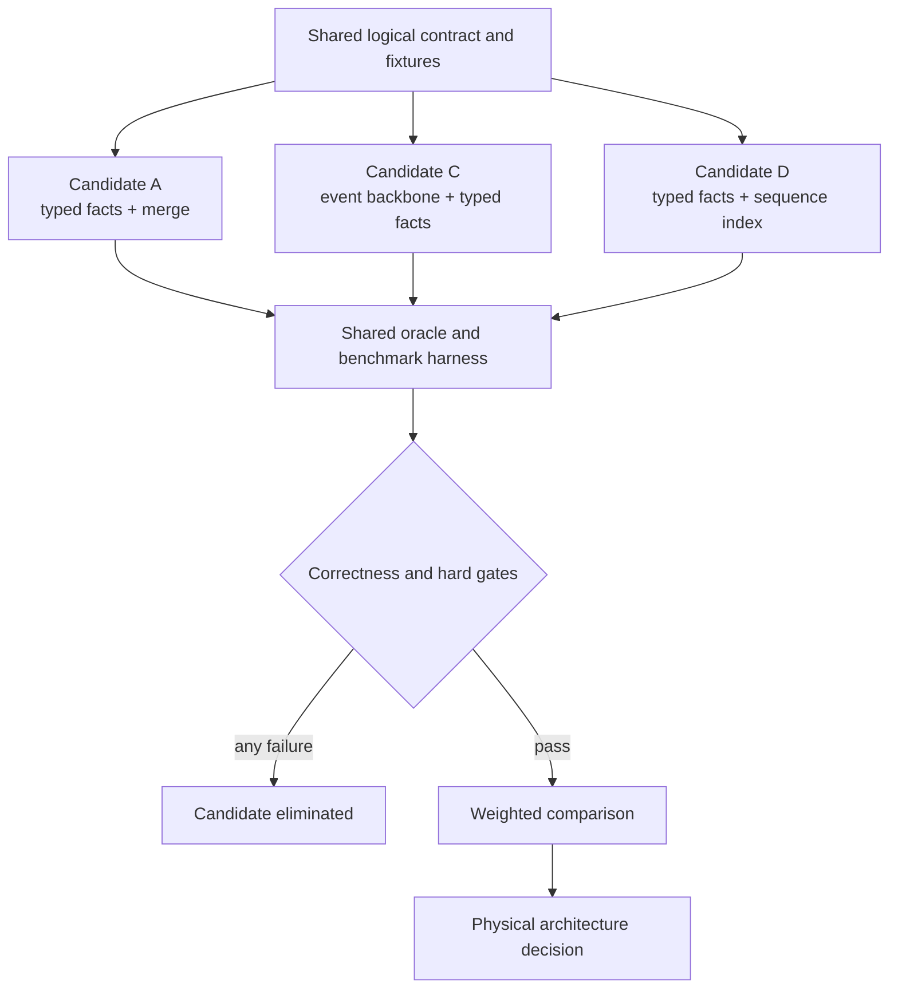

# Physical Architecture Bake-Off

**Status:** Required decision gate before production kernel implementation
**Candidates:** A, C, D
**Decision output:** `docs/decisions/PHYSICAL_ARCHITECTURE_DECISION.md`

The bake-off chooses a physical implementation of the shared logical contract.
It is deliberately smaller than a production rewrite: each candidate implements
the same five vertical slices, synthetic source generator, queries, evidence,
publication path, and failure matrix.

## Decision boundary

The bake-off may create code only under:

```text
experiments/physical-architecture/
tests/experiments/physical-architecture/
```

Candidate code cannot be imported by the production package. The selected
design is documented, then implemented cleanly under
`src/codex_usage_tracker/agent_kernel/`.

The experiment pins:

- Python and SQLite versions;
- operating system and filesystem;
- CPU model, logical/physical cores, memory, and storage;
- compiler/runtime flags;
- fixture seed and manifest digest;
- WAL, page-size, cache-size, mmap, temp-store, synchronous, and ANALYZE state;
- cold/warm filesystem treatment.

## Shared inputs and outputs

Every candidate uses:

1. one logical schema contract;
2. one deterministic mixed-event fixture generator;
3. one canonical correctness oracle;
4. one set of adapter output records;
5. one evidence-selector contract;
6. one named-query registry;
7. one current-only projection set;
8. one publication and crash harness;
9. one measurement collector;
10. one installed MCP-shaped envelope generator.

Candidate-specific shortcuts may change storage, indexes, SQL, and maintenance
algorithms. They may not change facts, omit required evidence, precompute a
kernel conclusion, or relax missingness and coverage.

## Candidates

### Candidate A: typed facts plus timeline merge

Typed canonical fact and lifecycle tables own analytical fields. Evidence is
assembled by merging indexed tables on the shared total-order key. Current
projections store only admitted aggregate answers.

Expected strengths:

- direct typed query plans;
- low backbone duplication;
- simple entity ownership.

Risks to test:

- multi-table timeline merge and pagination;
- stable tie handling;
- evidence reconstruction CPU and temporary sorts;
- lifecycle transitions distributed across fact tables.

### Candidate C: event backbone plus lifecycle and typed facts

An immutable canonical event backbone owns total order and occurrence linkage.
Typed point-event facts and lifecycle entities own domain fields. Current state
and dirty-key projections serve bounded answers.

Expected strengths:

- stable evidence and one sequence authority;
- explicit point/lifecycle separation;
- clear occurrence and late-event behavior.

Risks to test:

- row and index amplification;
- duplicated order keys;
- insert and dirty-key fanout;
- backbone joins on common aggregate plans.

### Candidate D: typed facts plus compact sequence index

Typed fact/lifecycle tables remain canonical. A narrow sequence index maps
total-order keys to entity kind, logical ID, and occurrence coordinate.

Expected strengths:

- fast evidence traversal with less backbone payload;
- direct typed analytics;
- compact page keys.

Risks to test:

- synchronization between facts and sequence index;
- crash consistency;
- late insertion and lifecycle transition behavior;
- extra write path without Candidate C's single event authority.



## Required vertical slices

Each candidate implements all five.

### V1: context deterioration

- sessions, turns, model calls, four token classes, context window, and
  compaction boundary;
- named cache-reuse and context-pressure plans;
- consecutive uncached-input jumps;
- exact selected-session evidence page.

Required questions: `Q-CTX-01`, `Q-CTX-02`, `Q-CTX-04`.

### V2: workflow sequence and first mutation

- tool lifecycle across publications;
- transport/operation/resource separation;
- turn first action, first successful tool, and first observed mutation;
- repeated-resource sequence;
- state change after multiple preceding calls/tools without causal
  attribution.

Required questions: `Q-WF-01`, `Q-WF-02`, `Q-WF-03`, `Q-WF-05`, `Q-OPS-04`.

### V3: allowance interval accounting

- every observation, including repeats;
- adjacent compatible intervals and reset boundaries;
- exact calls/turns/events between observations;
- current rate-card valuation and missing coverage.

Required questions: `Q-ALW-01`, `Q-ALW-02`, `Q-ALW-03`.

### V4: parent/subagent aggregation

- late parent discovery;
- parent-exclusive, descendant-exclusive, and family-inclusive usage;
- multi-level hierarchy;
- copied child source occurrence.

Required questions: `Q-ACC-05`, `Q-DEL-01`.

### V5: evidence reconstruction and source lifecycle

- logical selectors and occurrence coordinates;
- keyset timeline pagination;
- equal timestamps and late events;
- active/archived copies, truncation, replacement, and recanonicalization;
- selector stability after clean rebuild.

Required questions: `Q-OPS-03`, `Q-OPS-04`.

## Fixture shape

The fixture generator emits only synthetic metadata. It records a manifest with
seed, files, bytes, event ratios, time range, duplicates, missing fields,
capabilities, rate cards, and expected canonical counts.

Required scales:

| Scale | Model calls | Purpose |
| --- | ---: | --- |
| Tiny | 100 | Debug every oracle and crash point. |
| Small CI | 10,000 | Fast functional and plan regression. |
| Standard | 100,000 | Repeatable p95 and profiler workload. |
| Production-shaped | 1,316,864 | Current high-end local corpus shape. |
| Growth | 2,500,000 | Headroom and nonlinear-plan detection. |

Production-shaped ratios include tools, turns, activities, allowance
observations, repeated observations, observed state changes, parent/subagent
families, duplicate occurrences, late events, missing measurements, and
unpriced models. The generator must make each ratio independently tunable so a
candidate cannot overfit one frozen distribution.

History selections:

- current session or 24 hours;
- 7 days;
- 30 days;
- 90 days;
- one year;
- all time.

At least one three-year source layout includes 643 sources with timestamp hints,
uncertain sources, an archived copy, one replacement, and a moving active tail.

## Workload matrix

### Build and expansion

- empty database to each history selection;
- 30-day to 90-day, 90-day to one-year, and one-year to all-time monotonic
  expansion;
- all-time build at every scale;
- 1, 2, 4, and `min(physical_cores, 8)` parser workers;
- single-writer batched ingestion versus candidate-supported partitioned
  staging;
- secondary index present, deferred, and rebuilt;
- schema/projection version upgrade on an unpublished artifact.

Parallel parsing is admitted only when output order, identities, diagnostics,
and final bytes remain deterministic. SQLite publication keeps one explicit
writer authority. The harness reports speedup, parallel efficiency, peak RSS,
CPU time, wall time, queue wait, merge time, and writer utilization.

### Ordinary changes

- no source change;
- one appended model call;
- one tool start;
- terminal transition for a previously open tool;
- one tool plus one state change;
- 32-call tail;
- 2,000-call tail;
- a late event before the current cursor's event time;
- rate-card change with no source change.

No ordinary change may rebuild all facts, scan every source body, rebuild every
projection, or copy a complete generation.

### Unsafe changes

- source truncation;
- source replacement;
- canonical-owner change;
- identity/normalization version change;
- projection schema change;
- recanonicalization;
- database schema upgrade.

These use the large isolated-artifact protocol, never the short live tail
transaction.

### Queries and evidence

Run every Tier 1 preset plus the required bake-off slices:

- cold and warm first page;
- repeated identical request;
- deep keyset pages at 10, 100, 1,000, and 10,000-page positions;
- exact-count opt-in;
- current valuation after rate-card replacement;
- selected-session timelines;
- top-N with ties and deterministic order;
- complete server-side sort over admitted bounded result domains.

### Failure injection

Terminate the process:

- before staging begins;
- during parse;
- during fact writes;
- after facts and before projections;
- during projection update;
- after validation and before promotion;
- during promotion;
- after promotion and before sidecar reconciliation;
- during old-artifact cleanup.

Repeat for disk-full, malformed source, busy reader, stale writer lease,
corrupt staging artifact, and invalid rate card. The prior publication must
remain queryable.

## Measurements

Every result records:

- wall, process CPU, peak RSS, and CPU utilization;
- parser-worker time and parallel efficiency;
- fact, lifecycle, occurrence, sequence, and projection rows;
- database, table, index, free-list, WAL, journal, and temporary bytes;
- pages read/written and writer transactions;
- source files and bytes inventoried, selected, parsed, deferred, and rescanned;
- facts inserted, updated, recanonicalized, and left unchanged;
- dirty keys and projection rows read/written per named consumer;
- SQL latency distribution;
- `EXPLAIN QUERY PLAN`, full scans, automatic indexes, and temporary sorts;
- server and MCP-shaped latency;
- response bytes and duplicated representation bytes;
- tracker calls, batches, polls, retries, and refresh jobs;
- answer correctness.

Use `agent-perf` on the identical standard workload to identify Python CPU hot
paths. Compare unprofiled identical workloads for speed claims. Profile output
is attribution evidence only.

## Hard gates

All values are p95 on the pinned qualification host unless stated otherwise.
The decision artifact may tighten but may not weaken a gate without a recorded
product amendment.

| Workload | Hard gate | Stretch target |
| --- | ---: | ---: |
| 30-day first useful publication at production shape | `<=5 s` | `<=2 s` |
| 90-day first useful publication | `<=15 s` | `<=8 s` |
| One-year first useful publication | `<=45 s` | `<=25 s` |
| All-time 1.3M-call build | `<=120 s` | `<=60 s` |
| No-change refresh | `<=100 ms` | `<=50 ms` |
| One-call complete-history tail | `<=500 ms` | `<=200 ms` |
| One-tool lifecycle tail | `<=500 ms` | `<=250 ms` |
| 2,000-call append writer p95 | `<=50 ms` | `<=30 ms` |
| P1 named SQL plan | `<=25 ms` | `<=10 ms` |
| P2 named SQL plan | `<=100 ms` | `<=50 ms` |
| Evidence page SQL | `<=100 ms` | `<=50 ms` |
| P1/P2 local MCP response | `<=500 ms` | `<=250 ms` |
| Default query payload | `<=16 KB` | `<=8 KB` |
| Tier 1 tracker calls | `1`, optional evidence second | `1` |

Other hard gates:

- exact oracle equivalence;
- zero selector pagination gaps or duplicates;
- no unsupported causal or productivity field;
- no raw bodies in SQLite;
- no reader lockout during staging;
- same-snapshot publication identity and facts;
- prior publication survives every injected failure;
- database and WAL stay within the measured winning candidate's
  production-shape ratchet plus at most 25% headroom;
- ordinary tails have bounded dirty-key and projection fanout.

The harness stops a run as soon as a monotonic hard limit is irrecoverably
exceeded: for example, elapsed build time, database bytes, WAL bytes, full-scan
count, or projection fanout. It records the partial measurement and moves to
the next experiment instead of consuming another long wait.

## Selection rule

1. Eliminate any candidate that fails correctness, evidence stability,
   publication/recovery, data-handling, or a hard performance gate.
2. Rerun all remaining candidates from clean fixtures at least five times and
   report median, p95, variance, and outliers.
3. Score remaining candidates:

| Dimension | Weight |
| --- | ---: |
| Ordinary-tail latency and write amplification | 25 |
| Cold build and expansion latency | 20 |
| Named query, evidence, MCP, and payload efficiency | 15 |
| Database/index/WAL size | 15 |
| Crash recovery and lifecycle simplicity | 10 |
| Evidence stability and selector cost | 10 |
| Implementation complexity and operability | 5 |

4. The highest score wins only if its advantage survives sensitivity analysis
   at 100,000, 1.3 million, and 2.5 million calls.
5. If scores are within five points, choose the simpler candidate unless the
   more complex candidate improves ordinary-tail p95 or evidence p95 by at
   least 25%.

The decision artifact contains fixture digests, code commit, raw aggregate
measurement files, query plans, failures, score calculation, sensitivity
analysis, selected tables/indexes, rejected alternatives, and follow-up
risks.

## DBHub research lane

[DBHub v0.24.0](https://github.com/bytebase/dbhub/releases/tag/v0.24.0) is
pinned for one dev-only experiment. It is not a candidate architecture,
runtime dependency, installed plugin dependency, or user workflow.

The experiment:

- runs local stdio only;
- connects only to a disposable synthetic SQLite snapshot;
- uses per-tool read-only mode and a strict row cap;
- records that DBHub 0.24.0 opens SQLite read-write, so the disposable copy
  must be made owner-writable only for the process and digest-verified after;
- exposes only schema search, read SQL, and a small parameterized custom-tool
  registry;
- deliberately executes the local generic route (`search_objects` plus
  `execute_sql`) and named-preset route (`top_sessions`);
- records five samples for each route with global sequence indexes `0..9` in
  alternating generic/named-preset order;
- measures correctness, wall/CPU time, scanned rows, SQL statements, MCP calls,
  and response bytes;
- records scanned rows and SQL statements only as observed/unavailable
  provenance; returned rows and route shape are not measurement substitutes.

DBHub is useful if it speeds schema and query-plan exploration or demonstrates
which parameterized presets reduce agent work. It is rejected as a product
dependency if generic SQL needs more calls, weakens semantic grades, cannot
enforce the bounded contract, or encourages plans outside the registry.
Custom tools remain interesting as design inspiration for typed named plans.

CK-04 is a deterministic local-route benchmark, not an installed-model
qualification. The current runner invokes no model, and exact model identity,
host/runtime versions, reasoning effort, exact synthetic-prompt artifact
identity/hash, token source, and authorization for billed calls were never
frozen. CK-11 owns that deferred operability evidence.

## Semantic Kernel decision

Semantic Kernel is not used in the MVP or bake-off. Its current repository
describes Microsoft Agent Framework as its successor and centers agent
orchestration, plugins, memory, and multi-agent workflows. Codex already owns
the model loop and tool orchestration; adding another orchestration framework
would increase dependencies, latency, token surfaces, and host coupling without
improving the local fact kernel.

The portable ideas retained are small: typed tool contracts, explicit
capabilities, structured results, and adapter boundaries. Reconsider an agent
framework only if a future host-neutral product requirement cannot be met by
the MCP/skill/adapter seam.
