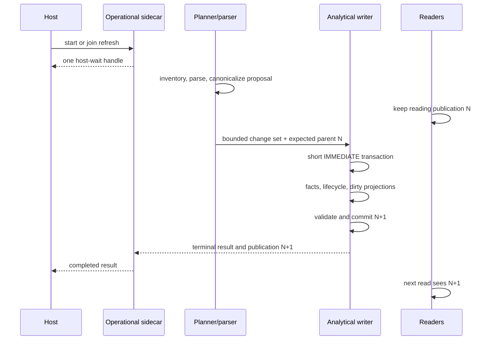
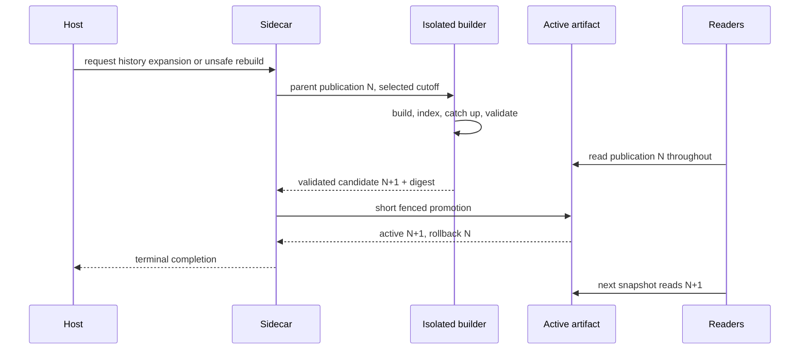
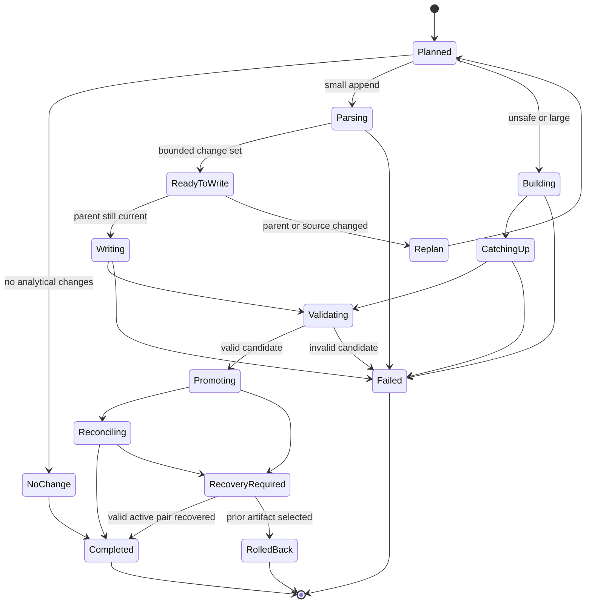

# Publication, Refresh, and Recovery

**Status:** Implementation authority
**State machine:** `codex-usage-tracker.publication.v1`

This protocol prevents the two failure modes that most damaged the spike
experience: holding a long SQLite write lock through parsing/derived work, and
redoing whole-database or whole-projection work for an ordinary tail.

## Invariants

1. A committed publication is immutable analytical truth.
2. Readers obtain publication identity, facts, projections, coverage, and
   selectors from one SQLite read snapshot.
3. The operational sidecar is never accounting truth.
4. Parsing, source inventory, and large artifact work occur without holding the
   published analytical write lock.
5. A small tail has bounded source ranges, fact mutations, dirty keys,
   projection rows, transaction time, and WAL bytes.
6. A large or unsafe change builds and validates an isolated artifact.
7. Ordinary tails never rebuild every fact or projection and never copy a full
   logical generation.
8. Readers remain available on the prior publication while a writer works or
   fails.
9. Promotion is atomic and has a preserved rollback artifact/pointer.
10. A no-change operation performs no analytical write transaction.
11. One compatible active operation is reused by the host. Query does not join
    or start refresh.
12. The host waits. The model never polls.

## Operation classes

| Class | Examples | Path |
| --- | --- | --- |
| `no_change` | Same source revisions, same rate card, same schema/projections | Return current publication; operational summary only. |
| `append_safe_small` | One call, one tool transition, bounded complete records | Short incremental transaction. |
| `append_safe_large` | Bounded but exceeds small-tail row/byte/fanout limits | Isolated artifact or chunked catch-up selected before writing. |
| `valuation_only` | Publication rate-card frontier changes | Dirty affected valuation keys/projections; facts untouched. |
| `source_replace` | Truncation, replacement, canonical owner changes | Isolated artifact. |
| `recanonicalize` | Identity/normalization version changes | Isolated artifact. |
| `schema_upgrade` | Physical schema change | Isolated artifact. |
| `projection_upgrade` | Projection version/dependency change | Isolated artifact unless proven bounded and backward compatible. |
| `history_expand` | 30d to 90d/year/all time | Isolated monotonic artifact. |

The planner chooses a class before acquiring the analytical writer. If
inventory uncertainty prevents proof of `append_safe_small`, it chooses the
safe artifact path.

## Small append-safe refresh

### Planning outside the write lock

1. Capture source inventory and one moving-tail boundary.
2. Compare manifestation revisions and committed cursors.
3. Select bounded append-safe ranges.
4. Parse complete records into typed observations.
5. Canonicalize identity tuples against a bounded read snapshot.
6. Calculate proposed fact/lifecycle mutations and dirty keys.
7. Check small-tail limits:
   - selected bytes and records;
   - fact and lifecycle rows;
   - occurrence rows;
   - affected sessions, turns, resources, allowance cycles, and time buckets;
   - projection fanout;
   - expected WAL/page writes;
   - maximum staleness of the planning snapshot.
8. If any limit is exceeded or the active publication changed, replan or use
   the artifact path.

### Transaction

The transaction:

1. begins `IMMEDIATE`;
2. verifies the exact parent publication and source revisions;
3. inserts occurrences and new immutable facts;
4. appends lifecycle transitions and folds only affected current states;
5. applies canonical-owner changes only if already proven bounded;
6. updates source cursors;
7. derives dirty keys from the actual accepted changes;
8. updates/deletes only dirty projection rows;
9. validates local reconciliation and projection dependencies;
10. writes publication and coverage metadata;
11. commits.

No parser, filesystem scan, network fetch, full count scan, `ANALYZE`, index
build, or full projection calculation runs while the transaction is open.



## Dirty-key calculation

Accepted mutations emit keys such as:

```text
session_id
root_session_id
turn_id
call_id
tool_id
resource_id
allowance_cycle_id
model_profile_id
project_id
utc_day
calendar_bucket(timezone, grain)
rate_match_key
source_id
```

Each projection declares the subset it consumes and a deterministic key
expansion. The updater deduplicates keys before SQL. A lifecycle completion may
dirty the tool, turn, session/root family, resource, time bucket, and tool
profile; it does not dirty unrelated sessions or every historical bucket.

The transaction records per-projection dirty keys, rows read/written/deleted,
and elapsed time. A fanout budget breach rolls back and schedules the artifact
path.

## Moving-tail catch-up

New JSONL can arrive while setup or refresh runs. The initial boundary makes
the first parse deterministic. After the proposed publication is ready:

1. inventory only sources that were active at the boundary plus watcher dirty
   hints;
2. capture a second boundary;
3. apply at most two bounded catch-up passes;
4. if the tail keeps moving beyond the byte/record/time budget, publish the
   consistent first boundary with `observed_through` and `tail_pending`;
5. schedule or suggest one host-owned follow-up, never a model polling loop.

No publication chases an unbounded active tail.

## Large isolated-artifact path

1. Record the exact parent publication and operation intent in the sidecar.
2. Create a new owner-only artifact path; use an atomic filesystem clone only
   when its exact safety prerequisites are proven, otherwise initialize clean.
3. Stream selected existing facts or sources according to the operation class.
4. Build candidate-selected tables and indexes with bulk settings that are
   never exposed to readers.
5. Catch up a bounded moving tail.
6. Build admitted current projections.
7. Validate schema, quick/integrity checks, foreign keys, identity collisions,
   accounting oracles, lifecycle folds, coverage, selectors, and projection
   reconciliation.
8. Restore production SQLite durability settings and checkpoint.
9. Write the final publication record and artifact digest.
10. Acquire a short promotion lease, verify the parent and catch-up boundary,
    atomically swap the active pointer/artifact, and retain the prior artifact.
11. Reconcile the operational sidecar and release the lease.



## Publication authority

The analytical database stores an active publication row and its compatibility
versions. A read begins a transaction before resolving it. The active
publication cannot be a mutable sidecar value joined to newer facts.

For side-by-side artifacts, the owner-only active pointer is a small atomic
filesystem/configuration primitive. The selected artifact also contains its
own publication identity and digest; startup rejects a pointer/artifact
mismatch and selects the last valid pair.

## Operational sidecar

The sidecar owns:

- operation ID, request hash, compatibility key, and parent publication;
- state and stage;
- progress numerator/denominator with basis;
- worker PID/start token and heartbeat;
- artifact paths/digests;
- terminal result or compact error;
- active and rollback pointer intent;
- source dirty hints.

State and progress are updated atomically. An outer `running` state cannot
contain nested `failed` progress. A worker-start failure is immediately
terminal. Stale workers are identified by PID plus process-start token, not PID
alone.

A compatible host request joins the existing operation. Incompatible work
returns a bounded conflict with the active handle. Query never joins an
operation and never creates one.

## State machine



Terminal states are `completed`, `failed`, and `rolled_back`. Cancellation is
allowed before writing/promotion and becomes a terminal `failed` result with
category `cancelled`; it cannot abandon an ambiguous promotion.

## Startup recovery

Startup is read-first:

1. inspect active and rollback pointer/artifact pairs;
2. validate publication identity and lightweight integrity metadata;
3. choose the active valid artifact, or the prior valid artifact if promotion
   was interrupted;
4. open analytical reads;
5. reconcile sidecar state;
6. recover or terminalize stale jobs;
7. clean abandoned unpublished artifacts only after ownership and age checks.

Serving reads cannot fail merely because sidecar job recovery wants a write
lock. Analytical read startup never calls a repository method that writes to
the analytical database.

## Crash outcomes

| Crash point | Required outcome |
| --- | --- |
| Before analytical transaction | Publication N unchanged; operation resumable or terminal. |
| During small transaction | SQLite rollback; publication N remains active. |
| After small commit before sidecar terminal update | Startup derives completed result from publication operation ID. |
| During isolated build | Publication N readable; candidate discarded or resumed. |
| After validation before promotion | Valid candidate retained; no active change. |
| During pointer swap | Startup chooses a matching valid pointer/artifact pair. |
| After promotion before sidecar update | N+1 remains active; sidecar reconciles. |
| During old-artifact cleanup | Active and rollback artifacts remain protected. |

## No-change refresh

A no-change operation:

- reads source manifest metadata and watcher hints;
- verifies rate-card/schema/projection versions;
- performs no analytical `BEGIN IMMEDIATE`;
- changes no analytical bytes or WAL;
- returns publication, observed-through, inventory elapsed time, and zero
  change counters.

If scanning every source's filesystem metadata exceeds the no-change budget,
the watcher/source catalog must provide dirty hints with a bounded periodic
reconciliation schedule. Correctness cannot depend solely on watcher events.

## Source replacement and recanonicalization

Replacement and truncation create new manifestations and preserve old
occurrences. The artifact builder recomputes canonical ownership only for
affected identity domains, then validates global accounting reconciliation.

Identity, normalization, or adapter-version changes never run as an ordinary
tail. The new artifact records the old/new versions and selector aliases for
entities whose semantic identity is unchanged. Unsupported identity splits or
merges are explicit breaking changes.

## Schema and projection upgrades

- Schema upgrade creates a new database-v1-compatible artifact revision; it
  never mutates an unknown old schema in place.
- Projection upgrade rebuilds only admitted projections on an unpublished
  artifact unless a bounded online algorithm has its own crash proof.
- The active spike database is never an upgrade input.
- Failed upgrades leave the current publication and rollback untouched.

## Rate-card changes

A valid new rate-card frontier changes current valuation identity only for
matching calls at or after the explicit effective boundary. Earlier calls keep
their selected revision digest and value unless the newly admitted revision is
deliberately backdated. It does not parse sources, rewrite calls, or alter
exact token totals. Invalid, incomplete, cyclic, head-mismatched, or ambiguous
frontiers fail closed and leave the prior valid frontier active with a
diagnostic.

Revision rows are immutable and fully prepared before the writer lock. Inside
the publication transaction, `active_rate_card` selects the request's head
digest, retains `selected_at_us` when an ordinary tail keeps the same head, and
advances `publication_id` to the accepted publication. The writer and
same-snapshot artifact validator both walk the complete predecessor chain and
fail closed before head promotion when the chain is missing, cyclic, invalid,
or disagrees with the publication digest.

The valuation-only plan carries the exact affected
`ValuationDirtyInterval` rows. A backdated correction dirties only its
half-open `[effective_at_us, next_effective_at_us)` interval and the affected
match rules; publication recovery rolls the selected head and those prepared
rows back atomically.

## Repair and rollback

Repair is deterministic and operator/host initiated. It reports pointer pairs,
artifact digests, SQLite checks, publication compatibility, sidecar lag, and
recoverable actions. Rollback selects the preserved prior artifact atomically
and emits a new operational record; it never edits the prior artifact.

Before final spike retirement, rollback may select the untouched 0.28 runtime
and its independent database path. No database conversion is attempted.
