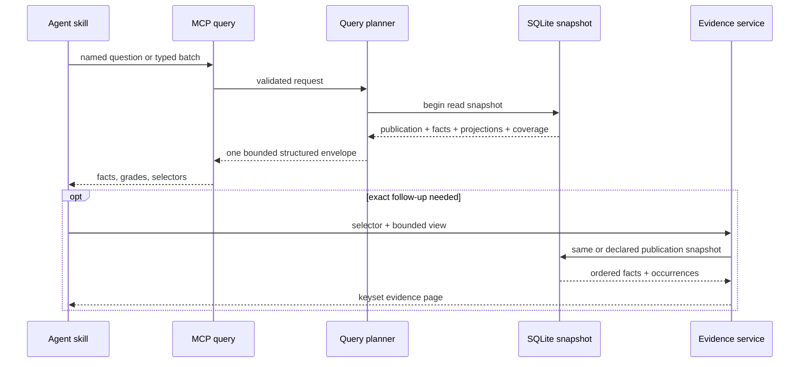
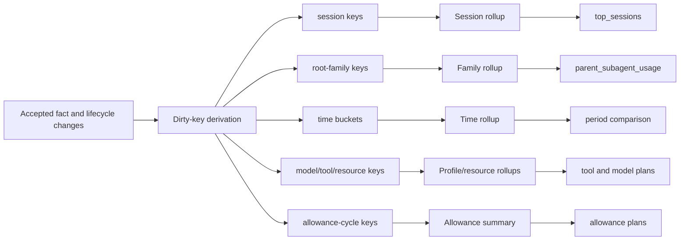

# Query, Evidence, and Projection Contracts

**Status:** Implementation authority
**Registry family:** `codex-usage-tracker.question-plan.v1`

The query surface is optimized for agent success, not schema exposure. Common
questions use named plans. Novel questions compose a small typed grammar.
Evidence is a separate bounded follow-up. No query starts refresh.

## Result grades

Every metric/column declares one grade:

| Grade | Meaning | Kernel storage |
| --- | --- | --- |
| `exact` | Direct observation or canonical sum/count. | Allowed |
| `deterministic` | Versioned reproducible calculation over exact facts. | Allowed |
| `configured_estimate` | Requires a validated external artifact such as a rate card. | Allowed with provenance |
| `model_inference` | Interpretation over disclosed facts/features. | Never a canonical fact |
| `unsupported` | Data cannot establish the requested conclusion. | Never a numeric substitute |

The kernel cannot relabel an estimate as exact because coverage is high. Missing
inputs remain `NULL`.

## Named-plan registry

Every Tier 1 question has a versioned registry record:

```yaml
question_id: Q-ACC-02
plan_id: top_sessions
plan_version: 1
parameters:
  window: required
  timezone: required
  limit: {default: 10, maximum: 25}
required_capabilities: [model_call_usage]
required_measurements: [uncached_input, cached_input, output]
answer_fields:
  uncached_input_tokens: exact
  cached_input_tokens: exact
  reasoning_tokens: exact_or_null
  output_tokens: exact
  top_share: deterministic
evidence: [E0, E1]
projection_consumers: [rollup_session_current, rollup_global_window]
order:
  - total_tokens desc
  - session_id asc
budgets:
  sql_p95_ms: 25
  mcp_p95_ms: 500
  response_bytes: 8192
```

The registry owns:

- intent phrases and question ID;
- request schema and defaults;
- capabilities and measurement requirements;
- logical plan and physical compiler name;
- answer grades and formulas;
- deterministic order and tie-breakers;
- coverage/freshness rules;
- evidence classes and selector kinds;
- admitted projections;
- SQL scan/sort, server, MCP, row, byte, and call budgets;
- synthetic oracle IDs;
- less-capable-model instruction snippet.

Registry changes require contract tests, qualification updates, and a version
change. A plan may not silently fall back to a broad generic scan that exceeds
its declared budget.

### Fact-backed plan admission

A named plan is admitted to implementation only after its exact typed request
has an executable fact-lineage triangle:

1. a scenario declaration emits canonical typed facts and selector
   occurrences;
2. an independent reference evaluator derives the expected row from those
   facts without calling the production compiler;
3. the permitted database-v1 fact plan produces the same row from one read
   snapshot.

The scenario, reference evaluator, and production plan may share versioned
formulas and contracts, but they cannot share computed answer rows. Candidate
or grading tables such as `question_cases`, `oracle_case` runtime reads, and
equivalent expected-answer caches are forbidden. A matching digest, formula
check, or database round trip alone does not admit a plan.

Every plan records its producer artifact identity, consumer seam check, and
requalification set. If any of those inputs change, the plan returns to
unimplemented until its seam qualification passes again.

### CK-08 internal implementation record

CK-08 implements the fact-backed registry, compiler, request/result contracts,
and query-only service in `agent_kernel/query/`, with selector resolution,
signed keyset cursors, and bounded evidence reads in `agent_kernel/evidence/`.
These are internal Python services only. They accept registered typed fields,
never raw SQL or SQL fragments, and cannot refresh, publish, acquire a writer
path, or read expected-answer/grading artifacts.

Qualification executes all 21 Foundation/Cutover plans across 42 CK-07A
fact-backed variants. Complete typed rows, grades, deterministic order,
request/comparison digests, and required evidence sequences match across the
two fact-adapter consumers. A downstream audit found both consumers import
production `evaluate_plan`; this proves fact-adapter and database replay parity,
not independent answer semantics. CK-08R1A must freeze corrected
Q-REV-03/Q-WF-02 meaning and executable transitive closure. R1C's independent
consumer is accepted at exact main
`fb0c57886097a6b985d2f321b2de858cbdfc0a97`; the exact
[R1B join authority](../decisions/evidence/ck08r1b/answer-semantics-join-authority.json)
bound the shared query/evidence/grading seams accepted through PR #430 and
exact-main `9e9332b3`. Final R1 replayed both accepted consumers, passed hosted
CI in PR #439, squash-merged, and was exact-main verified at `0832b854`.
CK-07R1's post-terminal deterministic-evidence roadmap completion makes
CK-08R4 the sole Ready packet; CK-08R4 must preserve
`runtime_acceptance=not_claimed` and independently measure current merged
publication behavior. Cursor serialization still
binds its version, request digest,
plan, publication, and order; malformed, tampered, stale, replacement, and
mismatched bindings fail closed.

CK-08 recorded standard and production-shaped query-only database-v1 fixtures
and provisionally labeled `latest_publication_delta`, `data_health`, and
`resource_hotspots` fact-table-sufficient and the other 18 plans
projection-required. The recorded `sql_p95_ms` includes compiler and Python
evaluation/materialization work, and runtime keyset slicing occurs after
complete result materialization. Those labels are not projection admission and
must be replaced by CK-08R2/CK-08R4 stage-separated physical measurements.
The historical deficiency, budget, candidate consumer, and bounded dirty-key
inputs remain recorded in
`docs/decisions/evidence/ck08/fact-backed-query-and-evidence-qualification.json`.
CK-08 adds no projection and CK-09 remains blocked.

Formula execution is governed by `formula-contract-v1.json`: 45 definitions,
61 catalog uses, and 185 answer-field bindings. Evidence execution is governed
by `selector-provenance-v1.json`. Each case declares ordered, role-tagged
required, conditional, and forbidden references. The materialized
`(role, selector_kind)` sequence must exactly equal the required sequence;
repeated kinds for different roles are valid. Each selector then resolves
through its authoritative owner with typed non-placeholder provenance.
`selector_anchors` is not a universal registry and no plan may substitute a
different kind when owner resolution fails.

Plan materialization is governed by `plan-operand-contract-v1.json`. It binds
every formula use and direct answer field to permitted logical relations,
typed request/publication/selector gates, grouping, complete order, closed
operand derivations, missing/empty behavior, and exact output extraction.
`compile_plan_operands` and `evaluate_plan` are production semantic seams, not
independent expected-answer authorities. Final R1 compares them with R1C for
all 80 variants. QueryService remains CK-08R2-bounded: its two direct plans
execute and 19 residual plans fail closed; R1 cannot invent physical support.

### Corrective physical admission boundary

`REMAINING_EXECUTION_PLAN.md` controls the corrective sequence. CK-08R0 froze
the exact inputs, page-execution request/result/stage contract, scale profiles,
budgets, output evidence schemas, lane locks, failure rules, and
requalification frontier in
`docs/decisions/evidence/ck08r0/corrective-gates-v1.json`. Completed CK-08R2 applies
complete order, keyset predicates, and `LIMIT page_size + 1` in SQL before
Python row materialization and may not call complete-result `evaluate_plan`.
CK-08R3A must first replace the physically unbounded EvidenceService outer
query while preserving selector, cursor, order, and budget semantics; CK-08R3
must then qualify evidence first/deep pages at both scales. CK-07R1 must
qualify publication-valid lifecycle preparation. CK-08R4 alone may classify a
plan as direct-page, evidence-page, or projection-required. CK-09 may admit
only the resulting measured residual list after CK-08RG.

CK-QG1A0 gated the selected PageExecutor successor. CK-QG1A removed R2's
rank-D findings and is accepted at exact main
`30983d4b5005e7e2a507757c76a3c05ab56281e6`. CK-QG1 PR #392 then passed the
exact authorized normalized baseline ratchet, hosted CI, squash merge, and
fresh exact-main verification at `68050b93`. R2 semantics, evidence,
thresholds, baseline, and generic-drift prohibition remain binding.

CK-07R1A is a separate lifecycle-performance lock: preserve the first hosted
Python 3.14 `ordinary.2000_call_tail` failure, frozen five budgets, fold and
publication semantics, and require attributable material correction before
PR #394 reruns the exact profile.

## Typed compositional boundary

The generic query grammar is allowlisted:

```text
dataset
operation
window
timezone
dimensions[]
measures[]
filters[]
group_by[]
order_by[]
limit
cursor?
include_exact_count?
```

Allowed operations are `rows`, `aggregate`, `share`, `comparison`,
`distribution`, and `timeline`. Dataset, dimension, measure, filter operator,
join path, and order key must be registered. Arbitrary SQL, expressions,
subqueries, user formulas, table names, and unbounded joins are rejected.

One request may contain up to eight independent plans so the agent can batch
related exact facts. The total result stays within one envelope byte budget.
The compiler rejects combinations with no admitted bounded plan and returns
compact guidance naming the closest presets/fields.

## Time, freshness, and coverage

- Windows are half-open integer UTC ranges derived from an explicit IANA
  timezone.
- `now` is captured once per batch.
- Calendar grains name timezone and week-start.
- All requests in a batch use one publication snapshot.
- Query reads committed facts even when a refresh is active.
- Insufficient coverage returns available facts plus a structured limitation
  when honest partial output is possible; otherwise it returns no rows and the
  exact expansion needed.
- Query never starts, joins, or polls refresh.

## Ordering, sorting, and pagination

Every plan defines a total order including logical-ID tie-breakers.

First pages use a registered index or a bounded admitted sort. Deep traversal
uses opaque signed keyset cursors containing:

- plan and plan version;
- publication ID;
- normalized request digest;
- last total-order tuple;
- expiry/version metadata.

A cursor from another publication or request fails with a restart hint. Offset
pagination is forbidden.

Sorting a displayed page in a client is not a product sort. User-requested
sorting must be compiled and applied to the complete eligible result domain
before pagination. An order is admitted only when:

- a suitable index/projection exists; or
- the plan's maximum domain is bounded and its complete server-side sort meets
  the plan budget.

Exact total counts are opt-in. Default page metadata returns
`returned_rows`, `has_more`, and `next_cursor`, not a full count scan.

## Human-readable fields

Ranked entity rows lead with:

- time/window where relevant;
- human label;
- entity kind;
- four token classes or the primary metric;
- status/completion basis;
- cost/credits and coverage where requested;
- concise operation/resource for tools;
- stable selector.

Opaque IDs, event IDs, generation internals, technical source paths, and
completion diagnostics belong at the end or in evidence metadata. Human labels
include provenance and fall back deterministically to a concise kind plus
short ID. A missing label cannot cause an empty result.

Tool rows present transport/tool name near the front, followed by semantic
operation and resource target. They never lead with an opaque invocation ID.

## Result envelope

One MCP result has one canonical structured representation:

```json
{
  "schema": "codex-usage-tracker.result.v1",
  "request_id": "opaque",
  "publication": {
    "id": "publication:...",
    "committed_at_us": 0,
    "observed_through_us": 0
  },
  "window": {
    "start_us": 0,
    "end_us": 0,
    "timezone": "America/New_York"
  },
  "coverage": {},
  "capabilities": {},
  "results": [
    {
      "question_id": "Q-ACC-02",
      "plan_id": "top_sessions",
      "plan_version": 1,
      "grades": {},
      "metrics": {},
      "rows": [],
      "caveats": [],
      "evidence_selectors": [],
      "page": {
        "returned_rows": 0,
        "has_more": false,
        "next_cursor": null
      }
    }
  ],
  "next_supported_questions": []
}
```

The transport may add a short scalar summary required by the host, but it
cannot duplicate the full rows as prose and JSON. Result serialization measures
final encoded bytes and fails closed before exceeding the hard maximum.

## Evidence service

Evidence accepts:

- one logical selector or compatible boundary pair;
- one view: `summary`, `timeline`, `calls`, `tools`, `resources`,
  `state_changes`, `allowance_interval`;
- direction and keyset cursor;
- row/byte limit;
- optional publication ID from the originating result.

It returns:

- resolved logical selector and alias basis;
- publication and coverage;
- entity summary;
- ordered rows with total-order keys, turn ordinal, lifecycle state/basis,
  four token measurements where applicable, transport/operation/resource,
  observed state changes, and occurrence coordinates;
- boundary selectors;
- page metadata.

An evidence page contains at most 100 rows and 16 KB. Evidence can page deeply
without omissions or duplicates and never requires a total count.

### Selector stability

Selectors survive:

- a clean rebuild from identical sources;
- source copy/archive;
- manifestation replacement with identical semantic events;
- physical schema/index/projection changes;
- publication rollback;
- late insertion.

If a supported identity-version correction changes string form without
changing the entity, a versioned alias resolves it and is disclosed. A semantic
split or merge cannot be hidden by aliasing.

### Occurrence evidence

Occurrence coordinates identify source manifestation/revision and record
byte range or ordinal. They prove provenance without storing or returning raw
body content. A caller may use the coordinate locally outside the MVP kernel,
but the evidence response does not dereference it.



## Projections

### Admission rule

A projection is admitted only when:

1. at least one named Tier 1 plan is an explicit consumer;
2. the fact-backed plan misses its SQL/MCP budget or creates excessive model
   payload/calls;
3. the projection's exact semantics and missingness are defined;
4. dirty keys can be derived from accepted mutations;
5. ordinary-tail write/storage cost fits its budget;
6. a fact-backed oracle reconciles every affected key;
7. current-only storage is sufficient;
8. rate-card dependency is explicit;
9. removal criteria are defined.

No projection is added for a possible future dashboard or arbitrary query.

### Dependency metadata

Each projection registry record contains:

```text
projection_id
version
physical_owner
consumer_plan_ids
source_entity_kinds
source_measurements
lifecycle_dependencies
rate_card_dependency
dirty_key_kinds
key_expansion
update_statement_ids
delete_semantics
validation_plan
row_budget
database_byte_budget
wal_byte_budget
tail_time_budget
removal_trigger
```

### Current-only semantics

Projections represent the active publication. Historical evidence remains in
canonical facts/occurrences and publication deltas; there is no complete
projection copy per generation. An old publication selected through rollback
uses its own complete artifact.

A rate-card-dependent projection carries the publication frontier head and the
selected revision digest for each valuation row. Rate changes update only
matching valuation rows/keys at or after their explicit effective boundary;
deliberately backdated revisions may update the corresponding older interval.
Exact token rollups never inherit a rate-card version.

### Initial candidate projections

These are hypotheses to measure, not automatic schema commitments:

| Projection | Candidate consumers | Dirty inputs |
| --- | --- | --- |
| Session/current usage rollup | `top_sessions`, `current_usage`, `top_expensive` | call tokens/status, hierarchy, project, label |
| Root-family usage rollup | `project_family_usage`, `parent_subagent_usage` | call tokens, parent/root relationship |
| Model/effort/time rollup | `model_effort_mix`, period drivers | call profile/tokens, UTC/calendar bucket |
| Daily usage rollup | current usage, comparisons, allowance overlay | call time/tokens, valuation key |
| Tool-family/resource rollup | tool behavior, resource hotspots | tool lifecycle, operation, resource, output/duration |
| Allowance interval summary | allowance movement/efficiency | exact adjacent observations, calls in interval |
| Latest publication delta | latest refresh changes | accepted publication mutation set |

The bake-off may eliminate, combine, or replace them.



## Latest-publication deltas

Publication writes a compact mutation summary from accepted change records:

- facts inserted, terminalized, corrected, removed, or recanonicalized by kind;
- exact four-class token delta;
- sessions/turns/tools/resources/state changes/allowance observations affected;
- source and coverage changes;
- bounded sample selectors.

Recanonicalization is not labeled new usage. The latest-change plan reads this
summary rather than diffing all current facts.

## Exact counts and storage attribution

Exact counts are separate plans with explicit budgets. They may use compact
metadata maintained transactionally only when a named consumer justifies it.

Aggregate storage diagnostics report:

- page size/count/free list;
- bytes by table and index;
- WAL bytes;
- current publication/projection versions;
- rows by fact/projection kind;
- source selected/deferred bytes;
- dirty-key and projection-write counters.

Diagnostics do not return raw rows or technical paths by default.

## Query-plan gates

Every named plan test asserts:

- expected compiler/plan ID;
- required index/projection;
- no unapproved full scan, automatic index, or temporary sort;
- deterministic order;
- exact oracle result and grades;
- coverage and selector validity;
- first-page and exact-count behavior;
- final response bytes;
- SQL and MCP p95 at 100,000 and 1.3 million calls;
- one-call skill route;
- no refresh/job creation.

Deep-page tests assert keyset work stays proportional to page size plus
registered bounded joins, not the skipped prefix.

## Unsupported query behavior

Requests for productivity, proven waste, causal tool impact, counterfactual
subagent savings, semantic task success, exact raw context, or an unqualified
allowance forecast return a compact supported reframing from the question
catalog. They do not synthesize a numeric answer.

## CK-08R2 physical page-execution amendment

`PhysicalPageExecutor` version 2 is the only admitted production answer path
for R2-supported direct plans. `QueryService` decodes and validates the signed
cursor before execution, keeps the publication binding inside the same
query-only snapshot, and runs the complete keyset predicate, total `ORDER BY`,
and `LIMIT page_size + 1` before decoding. The page size remains bounded to
100, so at most 101 rows cross the SQLite/Python boundary. The default
`include_exact_count=false` path executes no count statement.

The supported direct set is `data_health` and
`latest_publication_delta`. Their committed
[`pageExecutor`](../decisions/evidence/ck08r0/corrective-lane-evidence-v1.schema.json)
artifacts are under
[`docs/decisions/evidence/ck08r2/`](../decisions/evidence/ck08r2/).
Every other admitted plan remains unimplemented and reports its exact
complete-order physical/index gap with `projection_added=false`. This
amendment does not admit a projection, revise provisional plan
classification, or authorize CK-09.
