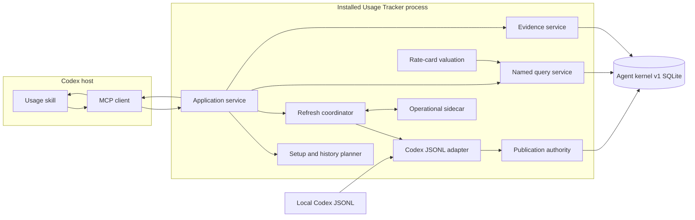
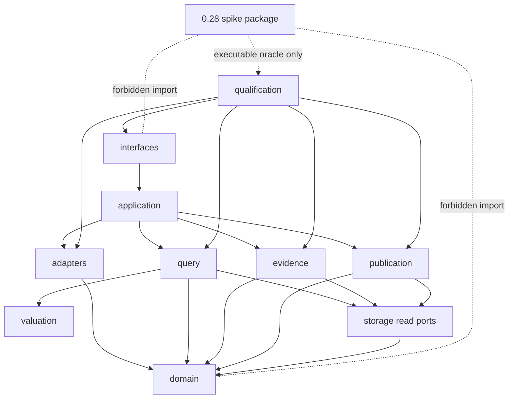

# Target Architecture

**Status:** Locked boundaries with bake-off-dependent physical internals
**Implementation root:** `src/codex_usage_tracker/agent_kernel/`

## Architectural shape

The product is one local Python package with a Codex adapter, a SQLite-backed
fact kernel, bounded query/evidence services, a small operational sidecar, and
thin CLI/MCP interfaces. Codex owns the model loop. No web application,
frontend runtime, orchestration framework, or general SQL surface sits in the
MVP path.



## Package ownership

The exact candidate-selected table modules are decided after the bake-off.
Dependency direction and public responsibilities are fixed.

```text
src/codex_usage_tracker/agent_kernel/
├── application/
│   ├── service.py
│   ├── setup.py
│   └── refresh.py
├── adapters/
│   ├── contracts.py
│   └── codex_jsonl/
├── domain/
│   ├── identity.py
│   ├── models.py
│   ├── time.py
│   └── measurements.py
├── storage/
│   ├── database.py
│   ├── schema.py
│   ├── facts.py
│   ├── occurrences.py
│   ├── lifecycle.py
│   └── operational.py
├── publication/
│   ├── planner.py
│   ├── writer.py
│   ├── projections.py
│   ├── recovery.py
│   └── validation.py
├── query/
│   ├── contracts.py
│   ├── registry.py
│   ├── compiler.py
│   └── service.py
├── evidence/
│   ├── selectors.py
│   ├── cursors.py
│   └── service.py
├── allowance/
├── valuation/
├── interfaces/
│   ├── cli/
│   └── mcp/
└── qualification/
```

CK-08 materializes the `query/` and `evidence/` ownership nodes as internal
query-only services. Their dependencies point to domain contracts and storage
read boundaries; they do not depend on application refresh/publication,
interfaces, test adapters, or expected-answer artifacts. Public CLI/MCP
exposure and physical projections remain later-packet work.



Dependency rules:

- `domain` imports no package layer.
- adapters depend on domain contracts, not storage.
- storage implements ports owned by publication, query, and evidence.
- query and evidence cannot invoke setup or refresh.
- interfaces translate typed requests/results and contain no SQL.
- qualification may call public boundaries and oracle harnesses but is not
  imported by runtime code.
- no module under the new root imports `codex_usage_tracker.kernel`.
- shared release primitives may be reimplemented or separately retained only
  through a cutover packet; the new kernel cannot depend on spike internals.

## Runtime components

### Application service

The application service is the only in-process public use-case router. It:

- validates typed CLI/MCP requests;
- opens the correct read or operational connection;
- calls one setup, refresh, query, evidence, allowance, or status operation;
- assembles one structured result envelope;
- enforces response budgets;
- never duplicates the complete result as both JSON text and structured data.

### Setup and history planner

The planner inventories candidate sources, captures one cutoff, estimates
selected work, applies the requested preset, and launches one host-waited
operation. It never parses unselected certain-old history. Coverage is an
output, not a hidden caveat.

### Codex adapter

The adapter implements `ADAPTER_CONTRACT.md`. It is the only Codex-specific
module. Canonical domain, storage, query, and evidence code cannot depend on
JSONL record classes or Codex field names.

### Canonical identity layer

Identity functions are pure, versioned, and fixture-driven. They produce
logical IDs and normalized tuples, detect collisions, and expose no database
I/O. Recanonicalization is an unsafe artifact operation.

### Analytical storage

One owner-only SQLite file,
`agent-usage-kernel-v1.sqlite3`, holds the committed analytical publication and
any candidate-selected staging structures. It stores facts, lifecycle,
occurrences, current state, coverage, selectors, and admitted projections. It
stores no raw bodies.

The physical decision may use one-file transactional staging for small tails
and side-by-side files for unsafe work. Readers always open the active
publication in read-only query mode.

### Operational sidecar

A small separate SQLite file,
`agent-usage-operational-v1.sqlite3`, owns:

- process leases and heartbeats;
- job/progress records;
- active-artifact pointer and rollback pointer;
- source dirty hints and watcher cursors;
- crash-recovery intents;
- recent bounded operation summaries.

It contains no analytical facts or large projections. Its write lock cannot
block analytical reads. Recovery may reconcile it from analytical publication
metadata; it is not truth for accounting.

### Publication authority

Publication owns the only analytical writer. It plans source changes, ingests
typed observations, canonicalizes occurrences, folds lifecycle state, computes
dirty keys, updates admitted projections, validates, and commits/preserves one
publication identity.

A live incremental transaction holds the analytical write lock only for
bounded database work. Parsing, large derived-state calculation, external
inventory, rate-card fetching, and artifact construction occur outside that
transaction.

### Projection maintainers

Each projection declares:

- version and physical owner;
- named consumer plans;
- source fact/lifecycle dependencies;
- dirty-key derivation;
- update and delete semantics;
- validation query;
- storage and write budget.

There is no projection for speculative future queries. Current projections do
not retain copies for every publication.

### Query planner

The planner compiles named presets and an allowlisted compositional grammar to
physical tables selected by the bake-off. It owns deterministic ordering,
keyset cursors, exact-count opt-in, scan/sort budgets, current valuation joins,
and result grades. Unknown fields or unsupported combinations fail with compact
guidance.

### Evidence service

Evidence resolves stable logical selectors, aliases, and occurrence coordinates
against one read snapshot. It returns page-bounded timelines, summaries, and
boundary evidence. It never loads raw bodies for MVP.

### Rate-card subsystem

Rate cards are local, versioned, validated inputs with source metadata and a
digest. The subsystem performs current configured valuation and coverage. A
rate-card change dirties valuation projections only; it does not recanonicalize
usage facts.

### MCP and skill interfaces

The MCP surface remains deliberately small. The exact tool split is finalized
after installed-agent qualification, but it must expose:

- status/setup or coverage;
- explicit refresh/expansion;
- bounded named/compositional query;
- bounded evidence;
- allowance access if not naturally covered by query;
- host-waited operation completion without model polling.

The skill maps user intent to named questions, chooses the smallest request,
interprets grades and caveats, and suggests evidence follow-up. It owns no
hidden calculations.

### CLI interface

CLI uses the same typed application requests and result envelopes. It adds
operator-friendly setup, repair, deterministic JSON output, and installed
smoke entry points. It is not a separate implementation.

## Query read lifecycle

1. Open a read-only SQLite connection.
2. Begin one deferred read transaction.
3. Read active publication identity and compatibility versions.
4. Compile and execute the named/bounded plan.
5. Resolve page selectors and coverage inside the same snapshot.
6. Commit/close.
7. Serialize one bounded envelope.

No status or query path opens a writer connection, recovers a job by writing,
refreshes, builds indexes, or hydrates history.

## Optional context composition

The architecture preserves a capability-gated, body-free structural seam:

- an admitted adapter may emit structural component observations;
- query results already support capability and measurement masks;
- context components have a logical contract, database-v1 relation, and
  evidence class.

CK-07C adds only the typed metadata relation required to represent positive
`context_component_coverage_v1` facts. It does not add an optional-content
database, fragment persistence, tokenizer dependency, raw context endpoint,
indexing command, or public product surface. Broader admission still requires
a separate post-MVP question and performance contract.

## Data Analytics and native presentation

The result envelope is renderer-neutral. Data Analytics may receive compact
typed rows for a custom report or visualization after the kernel answer is
available. The kernel does not install, call, or depend on Data Analytics.

Native Codex widgets, an Evidence Viewer, Live Watch, Claude Artifacts, and
shareable reports are future readers. Stable selectors, keyset cursors, answer
grades, and presentation hints are the only MVP seams retained for them.

## Installed-agent qualification harness

The harness:

- builds one exact wheel and plugin/skill bundle;
- installs into an isolated environment;
- launches fresh Codex CLI and Desktop tasks;
- uses a synthetic source root and dedicated cache;
- records exposed tools, version/digest coherence, MCP calls, tracker latency,
  response bytes, model tokens, final answer, grades, selectors, and usefulness;
- runs default and less-capable models;
- forbids source-checkout imports and side-channel usage;
- compares with deterministic question oracles;
- tears down only its synthetic state.

This harness is a product component for development and release qualification,
not runtime user functionality.

## Operational requirements

- owner-only cache permissions;
- loopback or stdio only for MVP;
- no telemetry export;
- analytical reads remain available during long artifact work;
- one compatible active job is reused by the host;
- job state and nested progress cannot disagree;
- a failed worker start is terminal and recoverable;
- no model-visible tight polling loop;
- logs contain structural IDs and aggregate counters, not raw bodies;
- diagnostic storage attribution reports aggregate table/index/WAL bytes.
