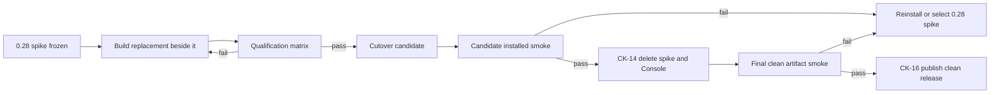

# Spike Disposition

> Historical evidence only. This document records how the 0.28 implementation
> is used during the clean cutover. It does not authorize new work in the spike
> architecture.

## Frozen reference

The executable spike is frozen at repository commit
`827be57663f9ac469f299ffdc5a3fc3e14694225` (the `origin/main` state from which
the clean-cutover program was created). Release tag `v0.28.0` remains the
public-release reference; the later frozen commit contains post-release query
and qualification corrections that are also useful as oracles.

The replacement implementation root is
`src/codex_usage_tracker/agent_kernel/`. It must not import from
`src/codex_usage_tracker/kernel/`, reach into its databases, call its internal
APIs, or copy its modules wholesale. Behavioral knowledge moves only through a
task packet with a named oracle, a clean implementation, and an equivalence
test.

## Disposition vocabulary

| Disposition | Meaning |
| --- | --- |
| `DELETE` | Remove now. Git history is sufficient. |
| `ARCHIVE` | Retain under `docs/archive/` as clearly non-authoritative evidence. |
| `ORACLE` | Keep executable until replacement qualification proves equivalent or intentionally changed behavior. |
| `TRANSPLANT` | Reimplement a narrowly named behavior under the new logical contract; do not import or copy the old module. |
| `DEFER` | Keep temporarily because deletion belongs to the cutover, not this planning change. |

## Applied cleanup

### Deleted

| Paths | Why |
| --- | --- |
| `.superpowers/**` | Obsolete workflow reports with no remaining authority. |
| `docs/superpowers/**` | Superseded plans and specifications. |
| `.agent-maintainer/change-plans/k1-oracle-baseline.md` | Completed reset-era change plan. |
| `docs/roadmap/product-kernel-reset.md` and `docs/roadmap/product-kernel-reset-execution.md` | Superseded roadmap and 2,000-line execution ledger; durable lessons are summarized here and in `SPIKE_PERFORMANCE_EVIDENCE.md`. |
| `docs/roadmap/product-recovery.md`, `docs/roadmap/product-recovery-execution.md`, and `docs/roadmap/product-recovery-tasks/**` | Superseded dashboard-and-kernel recovery program. |
| `docs/kernel-development-scope.md` | Replaced by `docs/INDEX.md`, the clean-cutover roadmap, and repository instructions. |
| `docs/kernel-context-composition.md` | Its redacted-fragment design conflicts with the metadata-only replacement; the optional structural-capability seam is documented in the new contracts. |
| `docs/kernel-overlay-adapter-contract.md` | Premature viewer/overlay contract. Stable selectors and cursors are retained without an MVP presentation burden. |
| `docs/upgrade-0.26.md` | Historical release guidance with no clean-cutover authority. |

The frozen code-disposition manifest remains only as a release oracle for the
0.28 package. Its obsolete workflow-path entries are removed so it cannot
reintroduce deleted planning artifacts.

### Archived

| Path | Continuing value |
| --- | --- |
| `docs/archive/spike/KERNEL_STABLE_CONTRACT_0_28.md` | Exact description of the shipped six-tool spike surface and its recovery claims. |
| `docs/archive/spike/ALLOWANCE_EFFICIENCY_FINDINGS.md` | Exact interval-compatibility and missing-ratio lessons. |
| `docs/archive/spike/OVERLAY_ADAPTER_CONTRACT_0_28.md` | Frozen read-only loopback, credential, DOM-capture, and Host/Origin security boundary. |
| `docs/archive/SPIKE_PERFORMANCE_EVIDENCE.md` | Measured build, storage, tail, query, and installed-agent evidence used to size the new gates. |
| This ledger | Historical catalog of what may be consulted as evidence, rewritten cleanly, retained temporarily, and later removed. |

Archived material is evidence, not implementation authority. If an archived
claim conflicts with an active document listed in `docs/INDEX.md`, the active
document wins.

## Retained executable oracles

| Disposition | Spike source | What it may prove | Replacement owner |
| --- | --- | --- | --- |
| `ORACLE` | `tests/kernel/fixtures/accounting-oracle-v1/**` | Four-class token accounting, duplicate-source behavior, hierarchy, and source lifecycle. | `CK-03`, `CK-07`, `CK-12` |
| `ORACLE` | `tests/kernel/test_oracle_equivalence.py` and `tests/kernel/oracle_support.py` | Synthetic totals and selector-level equivalence. | `CK-03`, `CK-12` |
| `ORACLE` | `tests/kernel/test_source_lifecycle_oracle.py` | Truncation, replacement, archival, and canonical ownership cases. | `CK-03`, `CK-06` |
| `ORACLE` | `tests/kernel/test_ingest_lifecycle.py` and focused ingest tests | Cross-publication tool lifecycle, interruption, and tail cases. | `CK-05`, `CK-06`, `CK-12` |
| `ORACLE` | `tests/kernel/query/**` and `src/codex_usage_tracker/kernel/query/**` | Query semantics, performance failure cases, and useful plan shapes. | `CK-08`, `CK-09` |
| `ORACLE` | `tests/kernel/allowance/**` | Exact observations, compatibility intervals, valuation coverage, and reset behavior. | `CK-03`, `CK-08` |
| `ORACLE` | `scripts/benchmark_kernel.py` and performance tests | Production-shaped distributions and regression baselines. | `CK-04`, `CK-12` |
| `ORACLE` | `scripts/benchmark_agent_outcome.py` and product-recovery scorecard fixtures | Fresh-agent timing, call-count, accuracy, and schema lessons. | `CK-11`, `CK-12` |
| `ORACLE` | `src/codex_usage_tracker/release/**` and `tests/release/**` | Exact-byte build and promotion safety. | `CK-16` |
| `ORACLE` | `config/kernel-retired-surfaces-v1.json` | Frozen public-surface removal inventory from the spike cutover. | `CK-14` |
| `ORACLE` | Current wheel, plugin, MCP, CLI, and skill surfaces | Side-by-side installed qualification and rollback reference. | `CK-11`, `CK-13`, `CK-14` |

Oracle status does not mean every behavior is correct. A task packet must state
whether it seeks equivalence, a deliberate correction, or removal.

## Candidate transplants

These are behavioral lessons, not module-copy instructions.

| Disposition | Lesson to reimplement | Required proof |
| --- | --- | --- |
| `TRANSPLANT` | Stable, versioned semantic identities independent of SQLite row IDs. | Identity vectors survive rebuild, late arrival, and source replacement. |
| `TRANSPLANT` | Canonical semantic facts separated from physical source occurrences. | Duplicate and archived manifestations cannot change accounting totals. |
| `TRANSPLANT` | Bounded JSONL streaming and malformed-source isolation. | One malformed source cannot corrupt or block a valid publication. |
| `TRANSPLANT` | Side-by-side artifact build and atomic promotion for unsafe work. | Crash matrix keeps readers on the prior valid publication. |
| `TRANSPLANT` | Exact four-class accounting and current rate-card coverage. | Missing measurements and missing rates remain `NULL`; totals reconcile. |
| `TRANSPLANT` | Exact allowance observations and compatible half-open intervals. | Repeated observations survive; reset and incompatible intervals yield no false ratio. |
| `TRANSPLANT` | Named, bounded query plans with stable logical selectors. | Plans meet their scan, latency, payload, and less-capable-model gates. |
| `TRANSPLANT` | Installed wheel/plugin/skill qualification in fresh hosts. | The exact built bundle is exercised end to end with no source-checkout fallback. |

## Deferred deletion

The following material belongs to the active spike runtime and remains only
until clean cutover:

- `src/codex_usage_tracker/kernel/**`
- `tests/kernel/**` and the synthetic oracle fixtures
- `frontend/kernel-console/**`, Console assets, browser tests, Node tooling,
  Console CI, and package-data rules
- spike MCP/HTTP/CLI schemas and the current plugin skill
- spike operational, content, live-stream, overlay, stable-contract,
  qualification, release-candidate, and retired-surface configuration
- spike benchmarks and installed-package smoke scripts
- current database files in user caches, which are never migrated or opened by
  the replacement

No new MVP requirement may be assigned to these paths. Corrective maintenance
is allowed only when needed to keep the public spike safe and usable before
cutover.

## Prohibited dependencies

The replacement must fail a repository ratchet if it:

- imports any module under `codex_usage_tracker.kernel`;
- opens a spike database or recognizes its schema as the replacement schema;
- uses a spike compatibility view;
- calls a spike-internal repository or service;
- treats a spike Console route as a product dependency;
- restores narrative analysis, telemetry, sanitization, redaction, or raw-body
  persistence;
- copies a spike module without a named transplant decision and a clean-room
  contract test.

## Runtime retirement history

The active runtime-retirement gate now lives in
`docs/roadmap/AGENT_FIRST_CLEAN_CUTOVER.md`. This archive records the spike
inventory and historical rationale only; it cannot authorize deletion, add a
condition, or waive one.

After CK-13 approves the exact candidate and proves the reinstall/select
rollback, CK-14 removes the spike implementation before the clean public
release. CK-14 qualifies an exact locally built candidate; verification by
downloading from the public package index belongs to CK-16 after publication.
The deletion includes the frontend, tests that prove only retired behavior,
Node dependencies, package data, compatibility routes, and stale release
configuration. Oracle fixtures with ongoing value are ported first. The
published package does not carry a legacy runtime; rollback means installing
the prior public 0.28 release and selecting its untouched database.

