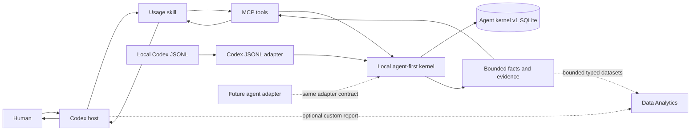

# Product Direction

**Status:** Accepted implementation authority
**Decision date:** 2026-07-28
**Program:** Agent-first clean cutover

## Decision

Codex Usage Tracker is becoming a local, agent-first workflow-observability
kernel. Its job is to make exact usage and workflow facts unusually fast,
compact, and easy for an agent to use. It is not a dashboard product, a generic
SQL browser, or a server-authored judge of waste or productivity.

The MVP is Codex-first. Host-neutral identities, capabilities, result
envelopes, and adapter boundaries preserve a clear future Claude Code seam, but
the MVP does not implement or qualify a second adapter.

The existing 0.28 implementation is a disposable spike and executable oracle.
The replacement is built beside it under
`src/codex_usage_tracker/agent_kernel/`, uses logical database identity
`codex-usage-tracker.agent-kernel.v1` and filename
`agent-usage-kernel-v1.sqlite3`, and imports nothing from
`src/codex_usage_tracker/kernel/`. Old databases are neither migrated nor
opened by the replacement.

## Target experience

The first five minutes should feel like this:

1. The agent asks one meaningful setup question: use the recommended 30-day
   fast start, or select 24 hours, 7 days, 90 days, one year, or all time.
2. The kernel inventories sources without parsing deferred history and returns
   selected bytes, an honest duration range, and an index-size estimate.
3. The host waits for one operation and displays progress. The model never
   polls.
4. The first useful publication appears quickly with explicit coverage.
5. A common question normally requires one named query and at most one evidence
   follow-up. It never starts an implicit refresh.
6. Reopening or asking another question reads the committed database
   immediately. Ordinary tails hydrate only new or changed source ranges and
   dirty projections.
7. The answer separates exact facts, deterministic derivations, configured
   estimates, model inference, and unsupported claims.
8. The agent suggests a small set of useful next questions and hands novel
   visualization or report work to Data Analytics when installed.

The primary product surface is the installed plugin, MCP tools, and skill. CLI
is the deterministic fallback and operator surface. Native presentation and
Data Analytics are readers of bounded result envelopes, not dependencies of
the kernel.

## Responsibility boundary

| Kernel owns | Model owns |
| --- | --- |
| Exact four-class token accounting | Interpretation and narrative |
| Sessions, turns, calls, tools, resources, and observed state changes | Prioritization |
| Deterministic identity, ordering, deduplication, and provenance | Workflow-churn and waste hypotheses |
| Freshness, history coverage, capabilities, and measurement masks | Causal caveats |
| Exact allowance observations and compatible intervals | Recommendations |
| Current rate-card valuations and pricing coverage | Skill, script, or endpoint suggestions |
| Named plans, bounded composition, and stable evidence selectors | Qualitative comparisons |
| Current-only dirty-key projections and publication authority | Deciding which exact evidence deserves follow-up |

No canonical fact, projection, query field, or MCP result field may encode
`waste`, `productivity`, `good_workflow`, `bad_workflow`, `churn`,
`tool_caused_increase`, `skill_candidate`, or an equivalent conclusion.
Deterministic feature vectors may expose the observations a model needs to form
a restrained hypothesis.

## Data-handling policy

The replacement performs structural validation and bounded normalization. It
does not promise sanitization or redaction of user metadata.

Required protections are:

- type, enum, and size validation;
- integer UTC timestamp normalization;
- UTF-8 handling;
- path normalization for identity and resource matching;
- SQL parameterization;
- malformed-source isolation;
- stable technical hashes where identity requires them;
- bounded MCP rows and payloads.

Secret detection, entropy scanning, credential filtering, privacy
substitutions, and redaction pipelines are out of scope. They add cost without
changing the fact that the source already exists locally. Raw prompt, response,
reasoning, command, patch, and tool-output bodies are not copied into SQLite
because they are large and unnecessary for the supported question contract.

Metadata remains local by default but may still be sensitive. The user owns the
decision to export or share it. Tests, documentation, benchmarks, and release
artifacts use synthetic data only.

## Locked logical decisions

- All stored times are signed 64-bit integer UTC microseconds. A query accepts
  an explicit IANA timezone for calendar boundaries and returns that timezone.
- Missing measurements are SQL `NULL`, never synthetic zero.
- Uncached input, cached input, reasoning, and output tokens remain separate.
- The reported `total_tokens` formula is explicit and cannot double-count
  cached input.
- Tool transport name and semantic operation are separate fields.
- Write intent, successful tool completion, and observed state mutation are
  distinct events.
- Every exact allowance observation is retained, including repeated values.
- Physical source occurrences and canonical semantic entities are distinct.
- Publication identity, facts, projections, coverage, and evidence resolve
  from one SQLite read snapshot.
- Current-only projections are updated by dirty keys; ordinary tails cannot
  copy a full generation or rebuild every projection.
- Queries never trigger refresh, expansion, valuation rebuild, or schema work.
- Evidence uses logical selectors plus occurrence coordinates, never SQLite row
  IDs.
- Generic exploration is bounded and typed. Generic SQL is not the primary
  product workflow.
- Rate cards are versioned inputs. Current valuations are reproducible
  configured estimates; missing prices remain missing.
- Codex is the only MVP adapter. A future adapter implements the same canonical
  output contract and capability mask.
- Data Analytics is an optional enhancement, never a runtime dependency.

## Physical direction

Candidate A's physical mechanisms are the selected CK-05 direction:

- typed canonical facts and lifecycle rows;
- physical source occurrences distinct from canonical entities;
- a bounded ordinary-tail overlay;
- indexed keyset merging of typed evidence streams;
- current-only dirty-key projections;
- short WAL transactions for proven-small safe changes;
- isolated artifacts and an atomic active pointer for large or unsafe work.

Candidate C was eliminated because its crash driver did not terminate a
process. Candidate D was eliminated after its production 30-day build exceeded
the `5 s` hard gate. Candidate A's recovery, SQL-derived-answer, planner,
parallel-parser, CPU-attribution, production-schema, and evidence proofs passed
the accepted CK-04 qualification. Three current-commit growth repetitions
passed; the maintainer waived repetitions 3 and 4 after directing the long run
to stop. The strict five-current-repetition v2 aggregate is therefore not
claimed. The bounded exception and remaining CK-05/CK-06 growth risks are
recorded in the physical decision.

The complete selection, exact CK-05 table/index inventory, measured projection
candidates, publication mechanism, limitations, and follow-up risks are in
[`PHYSICAL_ARCHITECTURE_DECISION.md`](PHYSICAL_ARCHITECTURE_DECISION.md).
Production code is a clean implementation of that decision, not a copy of the
experimental adapter.

## Non-goals

The MVP does not:

- build or maintain a dashboard, Evidence Console, Live Watch, overlay, or
  general presentation framework;
- implement Claude Code or another coding-agent adapter;
- persist or serve raw conversational or tool-output bodies;
- generate server-authored findings, diagnoses, or recommendations;
- expose unrestricted SQL as the default agent workflow;
- migrate the spike database or preserve obsolete internal APIs;
- implement team sync, hosting, account auth, billing, or cloud telemetry;
- recreate Data Analytics;
- add native widgets before the exact result and qualification contracts are
  proven;
- forecast allowance exhaustion as a kernel fact;
- infer semantic task outcome or productivity from usage metadata.

## Success measures

The exact budgets live in `docs/quality/QUALIFICATION_PLAN.md`; these are the
product-level gates:

- recommended recent-history setup returns a useful committed publication in
  seconds, not minutes;
- reopening status and common named plans are perceptibly immediate;
- a one-call or one-tool tail performs bounded source work and dirty-key writes
  only;
- Tier 1 questions are exact on synthetic oracles and normally use one tracker
  call;
- evidence selectors remain stable across rebuild, source replacement, and
  late events;
- less-capable supported models answer correctly without inventing zero,
  causality, or unsupported conclusions;
- the exact wheel, plugin, MCP catalog, and skill pass fresh Codex CLI and
  Desktop qualification;
- package, database, WAL, response, call, and model-token budgets have measured
  ratchets;
- rollback selects the untouched spike until the retirement checkpoint.

## Open decisions

Only the following material decisions remain open:

1. The exact projection subset admitted by measured Tier 1 consumers from the
   CK-04 candidate set.
2. The final public tool grouping and payload shape after installed-agent
   qualification.
3. Whether optional structural context composition earns a post-MVP capability.
4. Brand and package-name migration timing after the Codex-first MVP.
5. Which native presentation surface is officially available and useful at
   enhancement time.

Every other choice should be made within the controlling contracts without
requesting product reapproval.

## Superseded directions

The following no longer direct implementation:

- static or React dashboard development;
- the focused Evidence Console as a central product;
- server-authored narrative analysis or “token waste” findings;
- OTel-derived refresh phases or telemetry as a product dependency;
- privacy-mode, sanitization, secret filtering, or redacted-fragment systems;
- broad generation snapshots and compatibility views;
- default all-time first builds;
- model-polled background refresh jobs;
- Wemake and generic style-churn gates;
- prior kernel-reset and product-recovery roadmaps.

Their durable measurements and behavioral oracles are cataloged in
`docs/archive/SPIKE_DISPOSITION.md`.

## Product and system context

