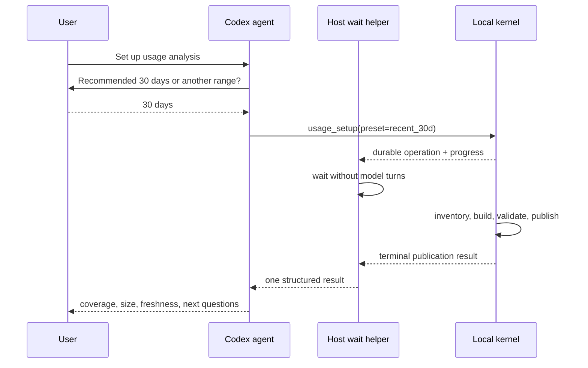

# Agent Setup and MCP Experience

**Status:** Codex-first MVP authority
**Primary principle:** The host waits; the model never polls.

## First-use conversation

The agent normally asks one question:

> Would you like the recommended 30-day fast start, or a different history
> range?

Supported choices:

| Choice | Intent |
| --- | --- |
| Current session / 24 hours | Immediate live investigation. |
| 7 days | Very small recent review. |
| **30 days** | Recommended balance of usefulness and setup speed. |
| 90 days | Quarterly comparison. |
| One year | Seasonality and longer-running patterns. |
| All time | Explicit comprehensive build. |

If the user's prompt already supplies a range, the agent does not ask again.
If the source inventory shows the chosen range is nearly all data, the agent
may report that fact but does not silently change the choice.

## Setup estimate

Before parsing, the kernel inventories bounded metadata and returns:

- candidate and selected source counts;
- candidate and selected bytes;
- timestamp-certain, uncertain, deferred, malformed, and missing sources;
- chosen UTC cutoff and timezone;
- expected duration as a measured range tied to fixture/hardware class;
- expected database range;
- whether an existing compatible publication can be reused;
- the next larger monotonic expansion.

The estimate is a configured/model-derived planning range, not a promise. It
names its benchmark revision and coverage. No raw source content crosses the
MCP boundary.

The agent summarizes in one sentence, for example:

> I found 643 source files. A 30-day start selects 17 files (14 MB) and should
> take about 2–5 seconds here; older history remains available to add later.

## Host-waited operation

Setup is one model-visible tool call. The runtime may use a worker and
operational sidecar internally, but Codex awaits it and displays host progress.
The model receives only a terminal result.

Requirements:

- no model-visible job-status polling;
- no duplicate refresh or setup requests;
- compatible duplicate host requests join one operation;
- worker-start failure returns one terminal recoverable error;
- progress stage and outer state are atomically consistent;
- heartbeats do not create transcript tokens;
- cancellation is host/operator-owned and deterministic;
- an interrupted call can be resumed by the host using durable operation
  identity without asking the model to loop.

The public skill never teaches `usage_job_status`. If a host lacks a suitable
long-tool wait path, setup uses the installed CLI as the host-owned fallback;
the model still makes one instruction-level operation and does not poll.



## Setup result

The terminal envelope includes:

```text
publication_id
history_preset
requested_cutoff
indexed_from
indexed_through
guaranteed_complete_from
observed_through
selected/deferred/uncertain source counts and bytes
canonical entity counts
database and WAL bytes
elapsed phase timings
rate-card status and pricing coverage
capability and measurement coverage
tail_pending
next_supported_questions
```

It does not include a narrative finding or raw source data.

## Reopen behavior

On every later invocation:

1. `usage_query` or `usage_status` opens the last committed database.
2. It returns immediately without source parsing, recovery writes, or
   projection rebuild.
3. It discloses freshness and coverage.
4. The agent suggests explicit refresh only when the question requires newer
   data or the user asks for live/current facts.

Opening a browser, closing it, restarting Codex, or starting a fresh chat
cannot rebuild the index. The database identity and publication are independent
of a UI session.

## Refresh and expansion

Refresh and history expansion are explicit:

- `refresh`: ingest current selected-history tails;
- `expand`: monotonically add a larger preset;
- `rebuild`: operator-only unsafe repair/schema operation.

The agent never uses refresh as a preflight ritual. For a question:

- query the committed publication first;
- use the answer when freshness/coverage meets the contract;
- if insufficient, explain the exact limitation and ask or perform the one
  explicit authorized operation;
- query once after the host-waited operation if the terminal result does not
  already contain the requested compact answer.

New calls may arrive while refresh runs. The publication protocol captures a
bounded tail and may return `tail_pending`; it does not chase the active file
forever.

## Proposed MCP responsibilities

Installed-agent qualification decides the smallest exact catalog, starting
from:

| Operation | Behavior |
| --- | --- |
| `usage_status` | Read-only publication, freshness, coverage, capabilities, storage health, and compatible operation state. |
| `usage_setup` | Host-waited first build or explicit monotonic history expansion. |
| `usage_refresh` | Host-waited selected-history tail refresh; joins compatible active work. |
| `usage_query` | Named presets and bounded typed batches; never refreshes. |
| `usage_evidence` | Bounded selector resolution and ordered evidence pages. |

Allowance questions should use named plans through `usage_query` unless
installed qualification proves that a dedicated `usage_allowance` materially
reduces model errors/calls. A public model-polled job-status tool is not part of
the target surface.

Every tool:

- uses a closed input schema;
- rejects unknown fields;
- returns one canonical structured envelope;
- caps rows and encoded bytes;
- exposes runtime, plugin, skill, schema, and plan versions where relevant;
- uses stable error codes with one actionable next step;
- contains no duplicate full-text projection.

## Query decision tree

The skill follows this fixed order:

1. Map user wording to a question ID.
2. Prefer one Tier 1 named preset.
3. Otherwise use one batched Tier 2 composition.
4. Use one evidence follow-up only when the user asks “why/show me” or the
   answer contract requires ordered/boundary evidence.
5. For model-inference questions, request the exact feature-vector plan and
   keep the conclusion in the model response.
6. For unsupported questions, offer the catalog's supported reframing.
7. Use Data Analytics only for a novel report, statistical workflow, or
   presentation beyond the compact kernel result.

The skill never:

- starts refresh before a warm query;
- performs tool discovery when the known tools are directly callable;
- splits one named question into many generic queries;
- requests exact counts unless needed;
- pages for completeness when the user requested top-N;
- invents selectors or evidence;
- treats missing as zero;
- converts adjacency to causality;
- calls an old Console route.

## Payload and call budgets

| Interaction | Tracker calls | Payload |
| --- | ---: | ---: |
| Tier 1 fact/ranking | 1 | Default 4–8 KB, hard 16 KB |
| Tier 1 evidence-required answer | 1 query + at most 1 evidence | 16 KB each |
| Tier 2 composition | 1 batch | Hard 16 KB |
| Model-inference candidates | 1 bounded feature batch + optional evidence | Hard 16 KB each |
| Setup/refresh/expansion | 1 host-waited operation | Compact progress outside transcript; terminal <=16 KB |

The final human answer should normally fit in a few hundred words plus a compact
table. The model should not echo coverage objects or opaque IDs unless they
matter.

## Evidence follow-up

Query rows carry human label, primary facts, grade, and selector. The agent can
say:

> The “Usage Tracker clean cutover” session is the top 7-day driver. I can open
> its exact turn/tool timeline if you want to inspect the sequence.

Evidence calls request only the selected entity and view. They return turn
ordinals, time, model/tool/resource names, lifecycle status, four token
classes, state-change observations, and stable selectors in human-first column
order.

## Suggested next questions

Setup and common answers return no more than five question IDs selected from
current capabilities, for example:

- “Which sessions account for most usage this week?”
- “What changed versus the preceding seven days?”
- “Where did cache reuse deteriorate under high input?”
- “Which tools, resources, or retries dominate this session?”
- “How did local usage move between allowance observations?”

Suggestions are catalog entries, not server-authored findings.

## Data Analytics handoff

When Data Analytics is installed, the skill can offer it for:

- a custom chart or report;
- statistical trend analysis;
- arbitrary cross-sections outside named plans;
- exported presentation artifacts.

The handoff includes one bounded typed result, semantic grades, metric
definitions, coverage, and source query metadata. It does not expose the SQLite
file, arbitrary SQL, credentials, or raw content. Without Data Analytics, the
kernel answer remains complete for its supported question.

## CLI fallback

CLI mirrors all application operations with deterministic JSON. It is used for:

- setup on hosts that cannot wait on a long MCP call;
- operator repair and rollback;
- benchmark and installed smoke;
- exact export of bounded results;
- diagnostics requested by a maintainer.

The skill may provide a copyable command to the user, but it does not silently
shell out for normal queries when MCP is healthy.

## Fresh-thread qualification

A fresh Codex CLI or Desktop task must:

- expose only the target tool catalog;
- report coherent runtime/plugin/skill/schema versions;
- answer a named warm question in one tracker call;
- perform zero refreshes and polls;
- use the exact returned rows;
- label facts/estimates/inferences correctly;
- include required human labels and selectors;
- stay within call, byte, latency, and model-token budgets;
- produce the expected oracle answer with a default and less-capable model.

Installation presence, process handshake, and task tool exposure are tested as
separate states. A cached old catalog requires a fresh task, not a reinstall
loop.

## Error design

Errors are compact and typed:

| Code family | Example next step |
| --- | --- |
| `coverage.insufficient` | Expand from 30 to 90 days. |
| `freshness.stale` | Run one explicit refresh if current data is required. |
| `capability.unavailable` | Use the supported metadata-only reframing. |
| `measurement.partial` | Answer observed subset with coverage or choose another metric. |
| `operation.active` | Host joins the compatible operation; model does nothing. |
| `operation.failed` | Report terminal cause and one repair/retry action. |
| `cursor.stale` | Restart evidence page on the current publication. |
| `plan.unsupported` | Use the named alternatives returned. |
| `rate_card.invalid` | Keep prior valid card or correct the local artifact. |

No error recommends repeated polling, a full rebuild as the first response, or
opening a retired dashboard.
