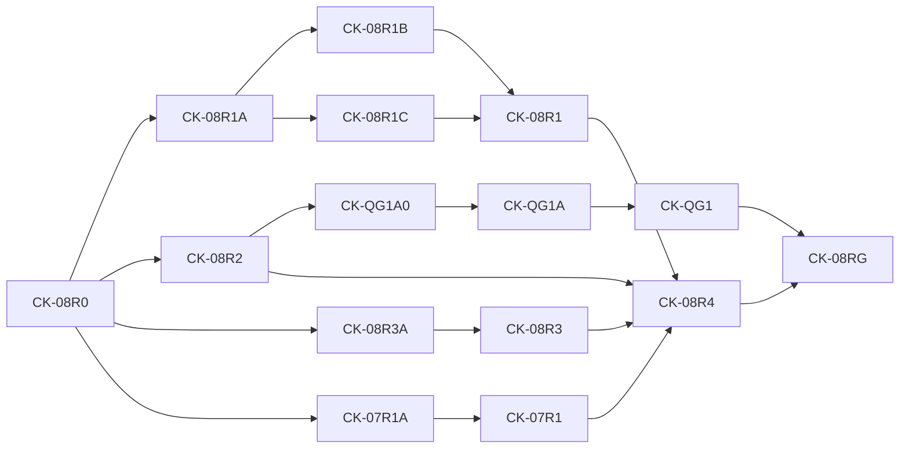

# Agent-First Clean-Cutover Roadmap

**Status:** Only authoritative implementation roadmap
**Program prefix:** `CK`
**Execution accounting:** `docs/roadmap/TASK_PACKETS.md`
**Remaining execution authority:** `docs/roadmap/REMAINING_EXECUTION_PLAN.md`
**Packet contracts:** `docs/roadmap/tasks/`

## Outcome

Build a local workflow-observability kernel giving installed Codex agents fast,
exact, compact, evidence-grounded answers; qualify it; remove the 0.28 spike
and Console before public release.

## Program rules

- Implement only under `agent_kernel`; never import/open/migrate spike runtime/data.
- Freeze contract and failing oracle before implementation. A task freezes a
  premise or implements it, never both.
- Every truth edge names exact producer, consumer, independent truth,
  executable comparison, and requalification. Copied rows/formula consistency/
  digests/database answers are not lineage.
- A disproved claim stops dependents, retains history, adds a correction, and
  replays affected seams. Never weaken a gate.
- Synthetic-only; query never refreshes; host waits and model never polls;
  ordinary tails are bounded; conclusions stay model-owned.
- CK-09–16 parents are umbrellas. Delegate only Ready child nodes from the
  machine DAG, one retained worktree/branch/PR each.
- Parallel writers require one immutable base, disjoint locks, and one shared-
  authority integrator. Use one final stable-diff read-only reviewer.
- Linear work requires explicit maintainer direction; backlog is source only.

## Phases

| Phase | Packets | Gate |
| --- | --- | --- |
| Authority/contracts | CK-00–03 | Catalog, logical vectors, fixtures/oracles exact |
| Physical decision | CK-04 | One candidate passes hard gates and selection |
| Canonical kernel | CK-05–08 plus 07A–E | Facts/publication independently reconcile to truth |
| Answers/evidence | CK-07R1/08R*/QG1/09 | Resume gate and all question/performance proof |
| Installed MVP | CK-10–12 | Exact artifact/task accuracy, calls, tokens, latency |
| Cutover | CK-13–14 | Replacement selected; rollback proven; spike deleted |
| Optional/release | CK-15–16 | Selected enhancement and byte-identical public artifacts |

## Critical path

```text
CK-00 -> CK-01 -> CK-02 -> CK-03 -> CK-04 -> CK-05 -> CK-06
-> CK-07 -> CK-07B -> CK-07C -> CK-07D -> CK-07E -> CK-07A -> CK-08
-> CK-08R0 -> {CK-08R1A, CK-08R2, CK-08R3A, CK-07R1A}
CK-08R1A -> {CK-08R1B, CK-08R1C} -> CK-08R1
CK-08R2 -> CK-QG1A0 -> CK-QG1A -> CK-QG1
CK-08R3A -> CK-08R3
CK-07R1A -> CK-07R1
{CK-08R1, CK-08R2, CK-08R3, CK-07R1} -> CK-08R4
{CK-08R4, CK-QG1} -> CK-08RG -> CK-09 -> CK-10 -> CK-11 -> CK-12
-> CK-13 -> CK-14 -> CK-16
```



CK-15 is optional and blocks CK-16 only if selected.

## Parallel opportunities

| Frontier | Disjoint work; shared owner |
| --- | --- |
| CK-02 | Fixture/oracle/benchmark cases; CK-03 owns manifest/schema |
| CK-04 | A/C/D experiment dirs; integrator owns harness/contracts/score |
| CK-07B–E | Formula/provenance → operands/valuation → two fact adapters; one contract/evidence owner |
| CK-07A/08 | Oracle replay and query/evidence implementations; public schemas single-owned |
| Corrective wave | R1A→R1B/C→R1; R2→QG1A0→QG1A→QG1; R3A→R3; 07R1A→07R1; R4 joins |
| CK-09 | Admitted projection families after registry freeze |
| CK-10/11/12 | App/skill, installed trial lanes, then immutable qualification lanes |
| CK-14 | Runtime and frontend deletion; package/CI joins |
| CK-15/16 | Optional presentation and release scope; release metadata single-owned |

Parallelism reduces elapsed time, never duplicates authority or permits shared
writes.

## Phase gates

### Gate G0: authority coherent

Index, product/question/logical/architecture/qualification/roadmap/ledger/DAG
agree; one packet file per node; archives cannot authorize work.

### Gate G1: executable contracts

All question IDs, formulas, selectors, identities, time/missingness, privacy,
request/result/evidence schemas, fixtures, oracle digests, and negative vectors
are executable before production code.

### Gate G2: physical decision

Candidate A/C/D run identical synthetic workloads with exact correctness,
plans, locks, storage/WAL/RSS, lifecycle/crash, response bytes, five unprofiled
samples, attribution, and early-stop rules. No waived run becomes success.

### Gate G3: canonical publication

Canonical identity/dedup/order/four tokens/provenance/capabilities/valuation,
source lifecycle, small/large publication, dirty keys, recovery and readable
prior generation pass without raw bodies or spike imports. Producer-to-
consumer replay reconciles published database-v1 facts to independent truth.

### Gate G4: answer kernel

CK-08 history is provisional. R1A freezes Q-REV-03/Q-WF-02 and closure; R1C
and R1B are accepted, with R1B exact-main verified at `9e9332b3`; R1's
schema-valid 80/80 production-independent requalification is complete on
merge, subject to hosted CI, squash merge, and exact-main verification. R2
bounds two direct plans while 19 fail
closed. R3A removes unbounded EvidenceService shape; R3 measures it. 07R1A
materially corrects the exact hosted tail before PR #394 resumes. QG1A0 authorizes
only the exact R2 PageExecutor successor; QG1A then removes
only R2's C/B/B findings before QG1 refreshes its baseline. R4 joins accepted
R1/R2/R3/07R1; RG plus QG1 alone may unblock CK-09. Exact oracles, selectors,
four tokens, cost/credits, allowance, SQL/MCP/byte/scale gates remain binding.

### Gate G5: installed Codex MVP

Exact wheel/plugin/skill clean install, coherent CLI/Desktop exposure,
setup/reopen, all Foundation/Cutover oracle answers, call/poll/refresh/latency/
byte/token budgets, and lower-capability lane pass without checkout side channel.

### Gate G6: clean cutover

Side-by-side synthetic drill, crash/recovery, untouched prior-public rollback,
package/data separation, and maintainer retirement approval precede deletion.

### Gate G7: public release

One protected build produces wheel/sdist/plugin/skill; hashes, sizes, clean
install, fresh tasks, public download byte equality, docs, and rollback pass.

## Performance objectives

Frozen qualification budgets: 30-day publication p95 <=5 s (stretch 2 s);
90-day <=15 s; one-year <=45 s; 1.3-million-call all-time <=120 s (stretch
60 s); no-change <=100 ms; one-call/tool tails and P1/P2 local MCP <=500 ms;
Tier 1 one tracker call and <=16 KB; fresh installed answer p95 <=15 s with
tracker versus host/model separated. These are gates, not estimates.

## Cutover criteria

CK-13 requires locked contracts and all Foundation/Cutover questions; complete
crash/lifecycle/history expansion; spike/public data separation; exact
artifacts on CLI/Desktop/lower-model; package/DB/WAL/response/token ratchets;
resolved review; and prior-release reinstall without touching new data.

## Runtime-retirement gate

CK-14 deletion additionally requires A/C/D decision, both-scale oracles, exact
cold/tail/no-change/query/evidence/installed budgets, lifecycle/replacement/
valuation/cross-publication recovery, side-by-side rollback without conversion,
fresh-task usefulness/calls/latency/tokens, exact clean-install candidate, and
explicit maintainer approval from the exact locally built candidate.
Public-index verification is a CK-16 post-publication check.

## Definition of done

Only the new kernel is packaged; spike/Console are deleted; catalog correctness,
evidence, performance, call/token/byte gates pass; tails are incremental and
lock-bounded; exact installed/public tasks pass; ledger blockers close; every
truth edge has current producer/consumer/independent proof.

## Explicit future items

MVP excludes non-Codex adapters, Evidence Viewer/Live Watch, MCP Apps/widgets,
Artifacts, bring-your-own packs, cross-agent/team/hosted comparisons, automated
recommendations, live overlay/DOM, shareable reports, and historical rate
cards. Admission needs a new contract, measured value, and no core regression.
